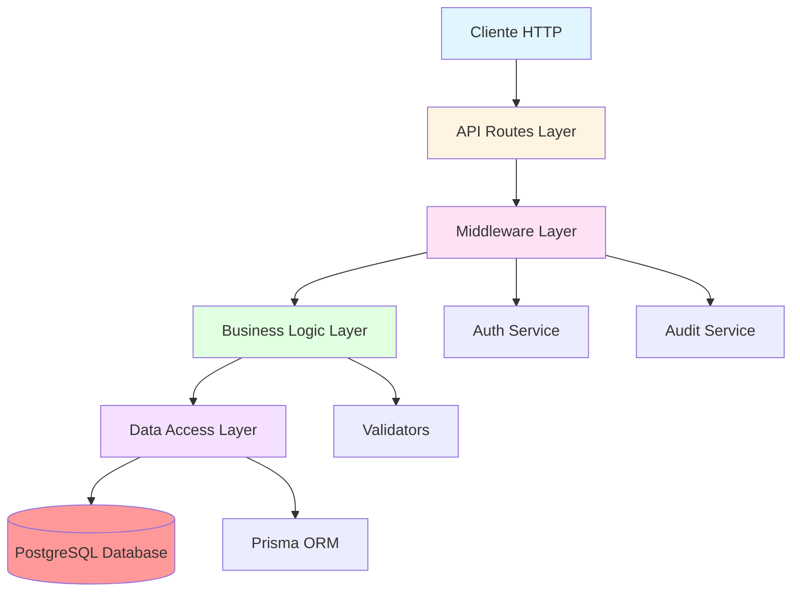
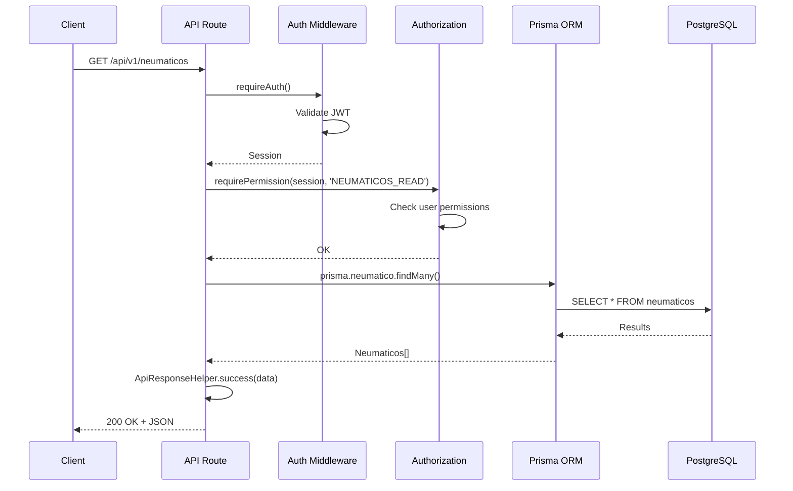
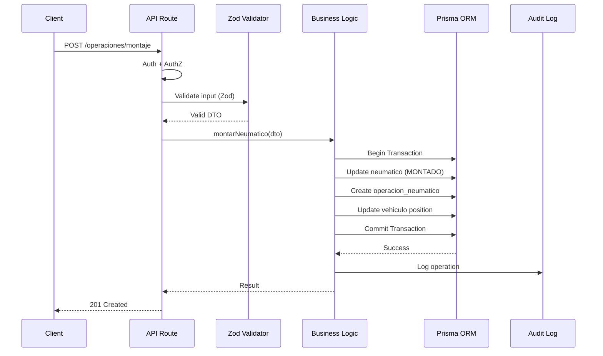
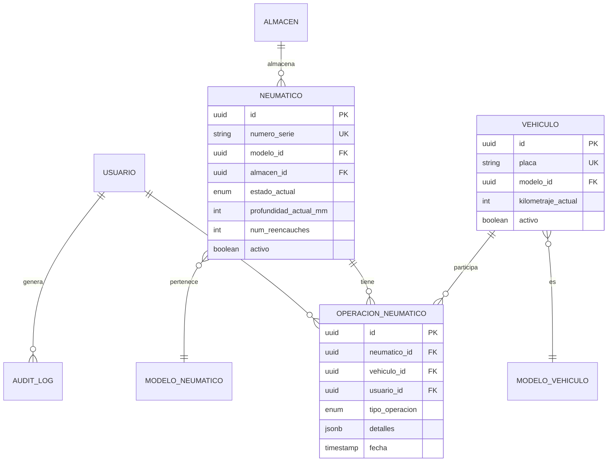

# Arquitectura del Sistema - GesNeu API

**Última actualización:** 2025-11-28 09:27 AM (UTC-5)  
**Versión:** 1.0  
**Estado:** Producción Ready

---

## Tabla de Contenidos

1. [Visión General](#visión-general)
2. [Arquitectura de Capas](#arquitectura-de-capas)
3. [Stack Tecnológico](#stack-tecnológico)
4. [Patrones de Diseño](#patrones-de-diseño)
5. [Estructura de Directorios](#estructura-de-directorios)
6. [Flujo de Datos](#flujo-de-datos)
7. [Seguridad](#seguridad)
8. [Base de Datos](#base-de-datos)
9. [Decisiones de Diseño](#decisiones-de-diseño)

---

## Visión General

GesNeu API es un **sistema de gestión de neumáticos empresarial** construido con Next.js 14 App Router, utilizando una arquitectura en capas que separa claramente las responsabilidades y facilita el mantenimiento y escalabilidad.

### Características Principales

- ✅ **API RESTful** con 7 módulos principales
- ✅ **Autenticación JWT** con NextAuth.js
- ✅ **RBAC** (Control de acceso basado en roles y permisos)
- ✅ **ORM** con Prisma para PostgreSQL
- ✅ **Validación** con Zod schemas
- ✅ **85 Tests** de integración y unitarios
- ✅ **Audit Logging** para trazabilidad
- ✅ **Documentación Swagger** completa

---

## Arquitectura de Capas



### 1. **Capa de Presentación** (API Routes)

**Ubicación:** `/src/app/api/v1/`

**Responsabilidades:**

- Recibir y validar requests HTTP
- Ejecutar autenticación y autorización
- Formatear respuestas (JSON)
- Manejo de errores HTTP

**Tecnologías:**

- Next.js 14 App Router
- Zod para validación
- NextAuth.js para autenticación

**Ejemplo:**

```typescript
// /src/app/api/v1/neumaticos/route.ts
export async function GET(request: NextRequest) {
  // 1. Autenticación
  const session = await requireAuth();
  
  // 2. Autorización
  requirePermission(session, PERMISSIONS.NEUMATICOS_READ);
  
  // 3. Lógica de negocio
  const neumaticos = await prisma.neumatico.findMany(...);
  
  // 4. Respuesta formateada
  return ApiResponseHelper.success(neumaticos);
}
```

---

### 2. **Capa de Middleware**

**Ubicación:** `/src/lib/auth/`, `/src/lib/audit.ts`

**Responsabilidades:**

- Validar JWT tokens
- Verificar permisos y roles
- Registrar auditoría
- Manejo de CORS

**Componentes:**

- `requireAuth()` - Verifica autenticación
- `requirePermission()` - Verifica permisos
- `auditLog()` - Registra acciones

---

### 3. **Capa de Lógica de Negocio** (Services)

**Ubicación:** `/src/lib/services/`

**Responsabilidades:**

- Orquestación de operaciones complejas
- Validación de reglas de negocio
- Transformación de datos
- Coordinación entre múltiples recursos

**Ejemplo:**

```typescript
// /src/lib/services/neumatico.service.ts
export class NeumaticoService {
  async montarNeumatico(data: MontajeInput) {
    // Validar estado del neumático
    // Validar disponibilidad de posición
    // Crear operación de montaje
    // Actualizar estados
    // Registrar en historial
  }
}
```

---

### 4. **Capa de Acceso a Datos**

**Ubicación:** Prisma Client

**Responsabilidades:**

- Abstracción de la base de datos
- Queries optimizadas
- Transacciones ACID
- Migraciones de schema

**Tecnologías:**

- Prisma ORM 7.0
- PostgreSQL 15+

---

### 5. **Capa de Persistencia**

**Ubicación:** Supabase (PostgreSQL)

**Características:**

- Base de datos relacional
- Connection pooling (Supavisor)
- Backups automáticos
- Replicación

---

## Stack Tecnológico

### Backend

| Tecnología | Versión | Propósito |
|------------|---------|-----------|
| **Next.js** | 14.2+ | Framework web full-stack |
| **TypeScript** | 5.x | Type safety |
| **Prisma** | 7.0+ | ORM y migrations |
| **PostgreSQL** | 15+ | Base de datos |
| **NextAuth.js** | 4.x | Autenticación |
| **Zod** | 3.x | Validación de schemas |
| **bcryptjs** | 2.x | Hashing de passwords |

### Testing

| Tecnología | Propósito |
|------------|-----------|
| **Jest** | Test runner |
| **Testing Library** | React component testing |
| **Supertest** | API testing |

### DevOps

| Servicio | Propósito |
|----------|-----------|
| **Vercel** | Hosting y CI/CD |
| **Supabase** | Base de datos PostgreSQL |
| **Sentry** | Error tracking |
| **GitHub Actions** | CI/CD pipeline |

---

## Patrones de Diseño

### 1. **Repository Pattern**

Prisma actúa como repository, abstrayendo el acceso a datos.

```typescript
// Prisma como Repository
const neumatico = await prisma.neumatico.findUnique({
  where: { id },
  include: { modelo: true }
});
```

### 2. **DTO Pattern** (Data Transfer Objects)

Validación y transformación con Zod.

```typescript
// /src/lib/validators/neumaticos.ts
export const createNeumaticoSchema = z.object({
  numero_serie: z.string().min(1),
  modelo_id: z.string().uuid(),
  // ...
});

export type CreateNeumaticoDTO = z.infer<typeof createNeumaticoSchema>;
```

### 3. **Middleware Pattern**

Autenticación y autorización como middleware.

```typescript
// /src/lib/auth/authorization.ts
export async function requireAuth() {
  const session = await auth();
  if (!session) throw new Error('UNAUTHORIZED');
  return session;
}
```

### 4. **Factory Pattern**

Helper para respuestas consistentes.

```typescript
// /src/lib/utils/api-response.ts
export class ApiResponseHelper {
  static success(data, message?) { ... }
  static error(message, status) { ... }
  static notFound() { ... }
}
```

### 5. **Singleton Pattern**

Cliente único de Prisma.

```typescript
// /src/lib/prisma.ts
export const prisma = new PrismaClient();
```

---

## Estructura de Directorios

```
gesneu_api/
├── src/
│   ├── app/
│   │   └── api/
│   │       └── v1/                    # API Routes (v1)
│   │           ├── neumaticos/        # CRUD Neumáticos
│   │           ├── vehiculos/         # CRUD Vehículos
│   │           ├── operaciones/       # Operaciones de neumáticos
│   │           │   ├── montaje/
│   │           │   ├── desmontaje/
│   │           │   ├── rotacion/
│   │           │   ├── inspeccion/
│   │           │   ├── reparacion/
│   │           │   ├── reencauche/
│   │           │   └── desecho/
│   │           ├── catalogos/         # Almacenes, Proveedores
│   │           └── usuarios/          # CRUD Usuarios (Admin)
│   │
│   ├── lib/
│   │   ├── auth/                      # Autenticación y Autorización
│   │   │   ├── auth.ts                # NextAuth config
│   │   │   ├── authorization.ts       # RBAC helpers
│   │   │   └── permissions.ts         # Definición de permisos
│   │   │
│   │   ├── services/                  # Lógica de negocio
│   │   │   └── neumatico.service.ts
│   │   │
│   │   ├── validators/                # Zod schemas (DTOs)
│   │   │   ├── neumaticos.ts
│   │   │   ├── operaciones.ts
│   │   │   ├── vehiculos.ts
│   │   │   └── usuarios.ts
│   │   │
│   │   ├── utils/                     # Utilidades
│   │   │   ├── api-response.ts        # Response helpers
│   │   │   └── constants.ts           # Constantes
│   │   │
│   │   ├── types/                     # TypeScript types
│   │   │   └── api.ts
│   │   │
│   │   ├── audit.ts                   # Audit logging
│   │   ├── prisma.ts                  # Prisma client
│   │   └── swagger.ts                 # Swagger config
│   │
│   └── __tests__/                     # Tests
│       ├── integration/               # Tests de integración
│       │   ├── neumaticos.test.ts
│       │   ├── vehiculos.test.ts
│       │   ├── operaciones.test.ts
│       │   ├── catalogos.test.ts
│       │   └── usuarios.test.ts
│       │
│       ├── lib/                       # Tests unitarios
│       │   └── auth/
│       │
│       └── helpers/                   # Test helpers
│           ├── auth-helpers.ts
│           └── database-helpers.ts
│
├── prisma/
│   ├── schema.prisma                  # Database schema
│   └── migrations/                    # Migraciones
│
├── .env                               # Variables de entorno
├── .env.backup                        # Backup de .env
└── package.json
```

---

## Flujo de Datos

### Request Flow (Ejemplo: GET /api/v1/neumaticos)



### Operation Flow (Ejemplo: POST /api/v1/operaciones/montaje)



---

## Seguridad

### 1. **Autenticación**

- **JWT Tokens** vía NextAuth.js
- **Session storage** en PostgreSQL
- **Password hashing** con bcryptjs (10 rounds)
- **Refresh tokens** (futuro)

### 2. **Autorización (RBAC)**

**Roles:**

- `ADMINISTRADOR` - Acceso total
- `GESTOR` - Gestión operativa
- `OPERADOR` - Operaciones básicas
- `CONSULTOR` - Solo lectura

**Permisos Granulares:**

```typescript
PERMISSIONS = {
  NEUMATICOS_READ: 'read:neumaticos',
  NEUMATICOS_CREATE: 'create:neumaticos',
  NEUMATICOS_UPDATE: 'update:neumaticos',
  NEUMATICOS_DELETE: 'delete:neumaticos',
  // ... 40+ permisos
}
```

**Implementación:**

```typescript
// En cada endpoint
const session = await requireAuth();
requirePermission(session, PERMISSIONS.NEUMATICOS_CREATE);
```

### 3. **Validación de Datos**

- **Zod schemas** en todos los inputs
- **Type safety** con TypeScript
- **Sanitization** automática

### 4. **Audit Logging**

Tabla `audit_logs`:

- `user_id` - Quién hizo la acción
- `action` - Qué hizo (CREATE, UPDATE, DELETE)
- `resource` - En qué recurso
- `details` - Detalles (JSON)
- `ip_address` - Desde dónde
- `created_at` - Cuándo

### 5. **Soft Delete**

Todos los recursos usan `activo: boolean` en lugar de DELETE físico para:

- Preservar integridad referencial
- Auditoría completa
- Posibilidad de recuperación

---

## Base de Datos

### Diagrama ER (Simplificado)



### Especialización

- **Normalización**: 3NF (Tercera Forma Normal)
- **Índices**: En claves foráneas y campos de búsqueda frecuente
- **Constraints**: Unique, FK, Check constraints
- **Enums**: Para estados y tipos (mejor que strings)
- **JSONB**: Para datos flexibles (detalles de operaciones)

---

## Decisiones de Diseño

### 1. **¿Por qué Next.js App Router?**

✅ **Ventajas:**

- API Routes nativas (sin Express)
- Server Components por defecto
- Fácil deploy en Vercel
- TypeScript first-class

❌ **Alternativas rechazadas:**

- Express.js - Más boilerplate
- NestJS - Overhead innecesario para este proyecto

---

### 2. **¿Por qué Prisma?**

✅ **Ventajas:**

- Type-safe queries
- Migraciones automáticas
- Introspección de DB
- Excellent DX

❌ **Alternativas rechazadas:**

- TypeORM - Menos maduro
- Sequelize - No type-safe
- Knex - Muy bajo nivel

---

### 3. **¿Por qué PostgreSQL?**

✅ **Ventajas:**

- ACID compliance
- JSONB support
- Full-text search
- Robustez empresarial

❌ **Alternativas rechazadas:**

- MySQL - Menos features avanzados
- MongoDB - No relacional (no apto para este caso)

---

### 4. **¿Por qué RBAC en lugar de ACL?**

**RBAC (Role-Based Access Control):**

- Más simple de gestionar
- Escalable (nuevos usuarios = asignar rol)
- Permisos granulares por módulo

**ACL sería overkill** para este proyecto.

---

### 5. **¿Por qué Soft Delete?**

✅ **Ventajas:**

- Auditoría completa
- Recuperación posible
- Integridad referencial preservada

❌ **Desventaja:**

- Queries más complejas (`where: { activo: true }`)

**Decisión:** Vale la pena el trade-off.

---

## Escalabilidad Futura

### Horizontal Scaling

1. **Stateless API** - Ya implementado
2. **Connection Pooling** - Supavisor activo
3. **Caching Layer** - Redis (Fase 8)
4. **CDN** - Vercel Edge Network

### Vertical Scaling

1. **Database indices** - Optimizar queries
2. **Query optimization** - Usar `select` específico
3. **Pagination** - Implementado en GET endpoints

---

## Monitoreo y Observabilidad

### Logging

- **Console logs** en desarrollo
- **Structured logging** (futuro)
- **Audit logs** en DB

### Error Tracking

- **Sentry** - Errores de producción
- **Error boundaries** en Next.js

### Métricas

- **Vercel Analytics** - Performance
- **Database metrics** - Supabase Dashboard

---

## Recursos Adicionales

- [Documentación API (Swagger)](/api/docs)
- [README.md](./README.md)
- [Guía de Despliegue](./VERCEL_SETUP.md)
- [Plan de Implementación](/.gemini/antigravity/brain/.../implementation_plan.md)
- [Walkthrough](/.gemini/antigravity/brain/.../walkthrough.md)

---

## Changelog de Arquitectura

| Versión | Fecha | Cambios |
|---------|-------|---------|
| 1.0 | 2025-11-28 | Documentación inicial de arquitectura |

---

**Autor:** Antigravity AI + Mateo  
**Licencia:** Privado
