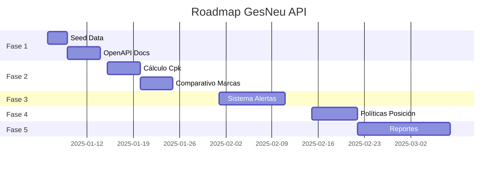

# 🚀 ROADMAP - GesNeu API

> **Stack Tecnológico**: Next.js 14 + TypeScript + Prisma + PostgreSQL (Supabase)  
> **Última Actualización**: 2025-12-22  
> **Basado en**: Requerimientos de Sistema API Ges_Neu_Final.pdf v2.1

---

## 📊 Estado Actual

| Área | Completado | Pendiente |
|------|------------|-----------|
| **Infraestructura** | ✅ API Routes, Prisma, Auth | OpenAPI docs |
| **CRUD Base** | ✅ Neumáticos, Vehículos, Catálogos | - |
| **Operaciones** | ✅ Montaje, Desmontaje, Rotación | Inspecciones programadas |
| **Historial** | ✅ EventoNeumatico, HistorialEstado | - |
| **Tests** | ✅ 84/92 (8 skipped) | Seed data para E2E |
| **KPIs/Reportes** | ⚠️ Parcial | Cpk, Alertas, Dashboard |

---

## 🎯 Fases del Roadmap

### Fase 1: Estabilización y Calidad (1-2 semanas)

**Objetivo**: Asegurar que la base actual es sólida antes de agregar funcionalidades.

| Prioridad | Tarea | Descripción |
|-----------|-------|-------------|
| 🔴 Alta | **Seed Data** | Crear script de seeding para tests E2E y desarrollo |
| 🔴 Alta | **Documentación OpenAPI** | Agregar decoradores/comments para generar Swagger automático |
| 🟡 Media | **Limpiar MD obsoletos** | Eliminar docs que mencionan Python/FastAPI |
| 🟡 Media | **Auditoría de seguridad** | Rotar credenciales expuestas, revisar RLS Supabase |

---

### Fase 2: KPIs y Cálculos de Negocio (2-3 semanas)

**Objetivo**: Implementar métricas críticas para optimización de costos.

| Prioridad | Tarea | Descripción |
|-----------|-------|-------------|
| 🔴 Alta | **Cálculo Cpk** | `costo_total / kilometraje_acumulado` por neumático |
| 🔴 Alta | **Desgaste promedio** | `(profundidad_inicial - profundidad_actual) / km` |
| 🟡 Media | **Comparativo marcas** | Endpoint para comparar Cpk por fabricante/modelo |
| 🟡 Media | **Historial de costos** | Tracking de costo_compra + reparaciones + reencauches |

**Endpoints a crear:**
```
GET /api/v1/reportes/cpk?neumatico_id=...
GET /api/v1/reportes/desgaste?vehiculo_id=...
GET /api/v1/reportes/comparativo-marcas
```

---

### Fase 3: Sistema de Alertas (2 semanas)

**Objetivo**: Prevención proactiva de riesgos de seguridad.

| Prioridad | Tarea | Descripción |
|-----------|-------|-------------|
| 🔴 Alta | **Modelo Alerta** | Nueva tabla `alertas` con tipos y severidades |
| 🔴 Alta | **Trigger profundidad** | Alerta cuando `profundidad_actual_mm < 4` |
| 🟡 Media | **Alerta reencauche** | Cuando `num_reencauches >= reencauches_maximos` |
| 🟡 Media | **Dashboard alertas** | Endpoint GET /api/v1/alertas con filtros |
| 🟢 Baja | **Notificaciones** | Webhook/Email para alertas críticas |

**Schema propuesto:**
```prisma
model Alerta {
  id            String   @id @default(uuid())
  tipo          TipoAlertaEnum
  severidad     SeveridadEnum
  neumatico_id  String?
  vehiculo_id   String?
  mensaje       String
  leida         Boolean  @default(false)
  creada_en     DateTime @default(now())
}
```

---

### Fase 4: Políticas de Seguridad por Posición (1-2 semanas)

**Objetivo**: Garantizar cumplimiento de normativas de neumáticos reencauchados.

| Prioridad | Tarea | Descripción |
|-----------|-------|-------------|
| 🔴 Alta | **Restricciones posición** | Campo `permite_reencauchado` en PosicionNeumatico |
| 🔴 Alta | **Validación montaje** | Bloquear montaje de reencauchado en posición restringida |
| 🟡 Media | **Configuración por tipo vehículo** | Diferentes políticas por tipo de unidad |

---

### Fase 5: Reportes y Dashboard (2-3 semanas)

**Objetivo**: Proveer información consolidada para toma de decisiones.

| Prioridad | Tarea | Descripción |
|-----------|-------|-------------|
| 🟡 Media | **Reporte inventario** | Stock por almacén, estado, modelo |
| 🟡 Media | **Reporte rendimiento** | Top/Bottom neumáticos por Cpk |
| 🟡 Media | **Reporte desechos** | Análisis de causas de desecho |
| 🟢 Baja | **Exportación CSV/Excel** | Exportar reportes a formatos comunes |
| 🟢 Baja | **UI Dashboard** | Página de visualización de KPIs (opcional) |

---

### Fase 6: Integraciones (Futuro)

**Objetivo**: Conectar con sistemas externos.

| Prioridad | Tarea | Descripción |
|-----------|-------|-------------|
| 🟢 Baja | **API para IoT** | Endpoints para recibir datos de sensores TPMS |
| 🟢 Baja | **Webhook ERP** | Notificar a ERP sobre eventos críticos |
| 🟢 Baja | **Import masivo** | Carga inicial de datos desde Excel/CSV |

---

## 📋 Resumen de Prioridades



---

## ✅ Criterios de Éxito

- [ ] Tests: 100% passing (incluyendo E2E con seed data)
- [ ] Cpk calculable para cualquier neumático
- [ ] Alertas activas para profundidad mínima
- [ ] Políticas de posición funcionando
- [ ] Al menos 3 reportes operativos disponibles
- [ ] Documentación OpenAPI completa

---

## 📝 Notas

1. **Stack Migrado**: El documento original menciona Python/FastAPI, pero la implementación actual usa **Next.js 14 + TypeScript + Prisma**. Este roadmap está adaptado al stack actual.

2. **Prioridad de Seguridad**: Las alertas de profundidad mínima son críticas para evitar accidentes.

3. **Datos de Prueba**: Antes de avanzar con nuevas features, es esencial tener seed data para desarrollo y testing.
