# Guía de Despliegue en Vercel - GesNeu API

**Última actualización:** 2025-11-28 09:44 AM (UTC-5)  
**Versión:** 1.1  
**Tiempo estimado:** 30 minutos  
**Método:** GitHub → Vercel (Auto-deploy)

---

## 🎯 Flujo de Trabajo Recomendado

```mermaid
graph LR
    A[Git Push] --> B[GitHub]
    B --> C[Vercel Auto-Deploy]
    C --> D[Build & Test]
    D --> E[Production Live]
    
    style A fill:#e1f5ff
    style B fill:#24292e
    style C fill:#000
    style D fill:#fff4e1
    style E fill:#e1ffe1
```



**Ventajas:**

- ✅ **Auto-deploy** en cada push a `main`
- ✅ **Preview deploys** automáticos en PRs
- ✅ **Rollback** con un click
- ✅ **No requiere CLI** local

---

## Prerequisitos

- ✅ Cuenta en [Vercel](https://vercel.com) (gratis)
- ✅ Repositorio `Mikisbell/gesneu_api` en GitHub
- ✅ Base de datos Supabase configurada
- ✅ Tests pasando localmente (85/85)

---

## Paso 1: Preparación

### 1.1 Verificar Build Local ✅

```bash
npm run build
```

**Resultado esperado:** Build exitoso sin errores.

### 3.1 Actualizar NEXTAUTH_URL

Una vez deployado, Vercel te dará una URL como:

```
https://gesneu-api-xxx.vercel.app
```

**Actualiza la variable de entorno:**

1. Ve a tu proyecto en Vercel Dashboard
2. Settings → Environment Variables
3. Edita `NEXTAUTH_URL` con la URL de Vercel
4. Redeploy: Deployments → … → Redeploy

### 3.2 Configurar Dominio Custom (Opcional)

Si tienes un dominio propio:

1. **Vercel Dashboard** → Tu proyecto → Settings → Domains
2. **Add Domain:** `api.tudominio.com`
3. **Configurar DNS:**
   - Tipo: `CNAME`
   - Name: `api`
   - Value: `cname.vercel-dns.com`
4. **Esperar propagación** (5-60 min)
5. **Actualizar `NEXTAUTH_URL`** al dominio custom

### 3.3 Configurar CORS (Si usarás frontend externo)

En `next.config.js`:

```javascript
async headers() {
  return [
    {
      source: '/api/:path*',
      headers: [
        { 
          key: 'Access-Control-Allow-Origin', 
          value: 'https://tu-frontend.com' // o '*' para desarrollo
        },
        { 
          key: 'Access-Control-Allow-Methods', 
          value: 'GET, POST, PUT, DELETE, OPTIONS' 
        },
        { 
          key: 'Access-Control-Allow-Headers', 
          value: 'Content-Type, Authorization' 
        },
      ],
    },
  ];
},
```

---

## Paso 4: Verificación

### 4.1 Probar Endpoints

**Swagger UI:**

```
https://tu-proyecto.vercel.app/api/docs
```

**Health Check (crear endpoint primero):**

```
https://tu-proyecto.vercel.app/api/health
```

**Test con cURL:**

```bash
# Neumaticos (sin auth - debería dar 401)
curl https://tu-proyecto.vercel.app/api/v1/neumaticos

# Respuesta esperada:
# {"success":false,"error":"No autorizado","timestamp":"..."}
```

### 4.2 Verificar Logs

**Vercel Dashboard:**

- Tu proyecto → Deployments → Latest → View Function Logs
- Buscar errores o warnings

**Sentry (si configuraste):**

- Dashboard de Sentry → Ver errores capturados

### 4.3 Probar Autenticación

```bash
# POST login (necesitarás crear usuario primero con seed o directamente en DB)
curl -X POST https://tu-proyecto.vercel.app/api/auth/signin \
  -H "Content-Type: application/json" \
  -d '{"username":"admin","password":"..."}'
```

---

## Paso 5: Monitoreo

### 5.1 Vercel Analytics

- Automáticamente habilitado
- Ver métricas en Dashboard → Analytics

### 5.2 Vercel Speed Insights

```bash
npm install @vercel/speed-insights
```

```typescript
// app/layout.tsx
import { SpeedInsights } from '@vercel/speed-insights/next';

export default function RootLayout({ children }) {
  return (
    <html>
      <body>
        {children}
        <SpeedInsights />
      </body>
    </html>
  );
}
```

### 5.3 Configurar Alertas en Sentry

En Sentry Dashboard:

1. Settings → Alerts
2. Crear regla: "Error rate > 10/min"
3. Notificaciones por email

---

## Troubleshooting

### Error: "Build failed"

```bash
# Verificar build local primero
npm run build

# Ver logs detallados en Vercel
```

### Error: "Cannot connect to database"

- Verificar `DATABASE_URL` y `DIRECT_URL`
- Asegurar que Supabase permita conexiones desde Vercel
- Network restrictions en Supabase → permitir todas las IPs

### Error: "NextAuth configuration error"

- Verificar `NEXTAUTH_URL` apunta a la URL de Vercel
- Verificar `NEXTAUTH_SECRET` está configurado
- Redeploy después de cambiar variables

### Lentitud en API

- Usar connection pooling (ya configurado)
- Verificar que usas `DATABASE_URL` (puerto 6543) no `DIRECT_URL`
- Considerar plan superior de Supabase si hay muchas conexiones

---

## Mejores Prácticas

### 1. Variables de Entorno

- ✅ Nunca commitear `.env` al repositorio
- ✅ Usar `.env.example` sin valores reales
- ✅ Rotar secrets regularmente
- ✅ Diferentes secrets para staging/production

### 2. Deployments

- ✅ Usar GitHub integration (auto-deploy en push)
- ✅ Crear branch `staging` para testing
- ✅ Usar preview deploys para PRs
- ✅ Proteger branch `main` en GitHub

### 3. Seguridad

- ✅ HTTPS siempre (automático en Vercel)
- ✅ Headers de seguridad configurados
- ✅ CORS restrictivo en producción
- ✅ Rate limiting (implementar en Fase 8)

---

## Configuración Avanzada

### Serverless Functions Timeout

Por defecto: 10s (hobby), 60s (pro)

En `vercel.json`:

```json
{
  "functions": {
    "api/**/*.ts": {
      "maxDuration": 10
    }
  }
}
```

### Edge Config (Opcional)

Para feature flags y configuración dinámica:

```bash
vercel env add EDGE_CONFIG
```

---

## Rollback

Si algo sale mal:

1. **Vercel Dashboard** → Deployments
2. Encuentra el deployment anterior exitoso
3. Click en **… → Promote to Production**

O via CLI:

```bash
vercel rollback
```

---

## Próximos Pasos

Una vez deployado exitosamente:

- [ ] Marcar tareas de Fase 5 como completadas
- [ ] Comenzar Fase 6: Testing y QA
- [ ] Crear colección de Thunder Client/Postman
- [ ] Documentar casos de uso

---

## Recursos

- [Vercel Documentation](https://vercel.com/docs)
- [Next.js Deployment](https://nextjs.org/docs/deployment)
- [Supabase + Vercel](https://supabase.com/docs/guides/hosting/vercel)
- [NextAuth Deployment](https://next-auth.js.org/deployment)

---

**¿Problemas?** Revisa los logs en Vercel y Sentry, o consulta la documentación oficial.
