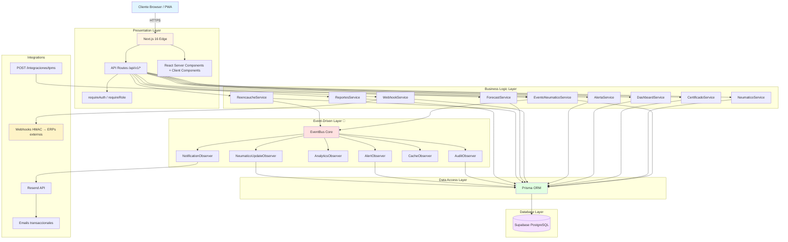
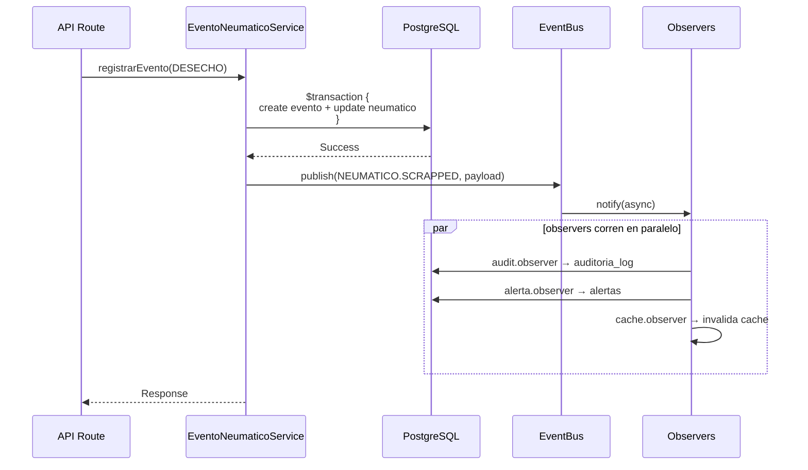

# 🏗️ Arquitectura — GesNeu API

> **Última actualización**: 2026-04-10
> **Documento complementario**: [`docs/00_PRD.md`](./00_PRD.md) — *qué* hace el sistema y *por qué*.
> **Este documento responde**: *cómo* está construido el sistema.

---

## 📑 Índice

1. [Stack tecnológico](#1-stack-tecnológico)
2. [Diagrama de arquitectura por capas](#2-diagrama-de-arquitectura-por-capas)
3. [Modelo de tenancy](#3-modelo-de-tenancy)
4. [Estructura del proyecto](#4-estructura-del-proyecto)
5. [Patrones de diseño](#5-patrones-de-diseño)
6. [Event-Driven Architecture](#6-event-driven-architecture)
7. [Modelo de datos (alto nivel)](#7-modelo-de-datos-alto-nivel)
8. [Sistema de autenticación y autorización](#8-sistema-de-autenticación-y-autorización)
9. [Decisiones arquitectónicas (ADR)](#9-decisiones-arquitectónicas-adr)
10. [Deuda técnica conocida](#10-deuda-técnica-conocida)

---

## 1. Stack tecnológico

| Capa | Tecnología | Versión |
|------|-----------|---------|
| **Runtime** | Node.js | 20+ |
| **Framework** | Next.js (App Router) | 16 |
| **Lenguaje** | TypeScript (strict) | 5 |
| **ORM** | Prisma | 7 |
| **Base de datos** | PostgreSQL (Supabase) | 15 |
| **Autenticación** | NextAuth.js (JWT) | 5 |
| **Validación runtime** | Zod | — |
| **PDF** | @react-pdf/renderer | 4 |
| **Emails** | Resend API | — |
| **Testing** | Jest + Playwright | — |
| **Deploy** | Vercel (serverless) | — |

---

## 2. Diagrama de arquitectura por capas



---

## 3. Modelo de tenancy

> ⚠️ **IMPORTANTE**: Esta sección corrige información desactualizada del documento anterior. Leer con atención si venís del ADR-005 histórico.

### 3.1 Estado actual: **Single-Tenant Operativo**

El sistema **opera como single-tenant**: una instancia atiende a **una sola empresa**. Pero el diseño del schema conserva infraestructura multi-tenant como **dormida** (no activada, pero preparada).

### 3.2 Cómo se implementa tenancy realmente

**Las entidades core tienen columna `empresa_id`** — se usa en todas las queries como filtro discriminatorio:

| Entidad | `empresa_id` | Comentario |
|---------|:-:|-----------|
| `Usuario` | ✅ | Cada usuario pertenece a una empresa |
| `Vehiculo` | ✅ | `@@unique([empresa_id, numero_economico])` |
| `Neumatico` | ✅ | `@@unique([empresa_id, numero_serie])` |
| `Almacen` | ✅ | `@@unique([empresa_id, codigo])` |
| `Proveedor` | ✅ | |
| `Inspeccion` | ✅ | `@@index([empresa_id, fecha_inspeccion])` |
| `CentroCosto` | ✅ | `@@unique([empresa_id, codigo])` |
| `LecturaPresion` | ✅ | |
| `WebhookConfig` | ✅ | |
| `CertificadoEmitido` | ✅ | `@@unique([empresa_id, folio_numero])` |

### 3.3 Cómo se popula `empresa_id` en runtime

Al autenticarse, el usuario trae `Usuario.empresa_id` desde la DB. NextAuth.js lo pone en la sesión:

```typescript
// src/lib/auth/auth.ts
session.user.empresa_id  // ← viene del campo Usuario.empresa_id
```

Todos los servicios productivos filtran explícitamente por `session.user.empresa_id` (protección IDOR). Ejemplo:

```typescript
// Patrón correcto en servicios
const vehiculo = await prisma.vehiculo.findFirst({
    where: {
        id: vehiculoId,
        empresa_id: session.user.empresa_id, // ← discriminante de tenancy
    },
});
```

### 3.4 Implicancias operativas

- **En producción existe UNA fila en `Empresa`** — todos los registros se crean con ese `empresa_id`.
- **Los tests de integración** pueden usar un UUID hardcoded (`00000000-0000-0000-0000-000000000000`) para setup — eso es OK, es un mock.
- **El endpoint `/admin/tenants`** existe pero debe esconderse con feature flag (ver deuda técnica).
- **El rol `SUPERADMIN`** del enum está dormido — no se usa porque no hay cross-tenant administration.

### 3.5 Cuándo se activará multi-tenant

**Post-estabilización total del sistema.** Decisión del stakeholder (2026-04-10): primero hacer funcionar single-tenant al 100%, después escalar complejidad. Ver [PRD §9](./00_PRD.md#9-visión-futura-tentativa-sin-compromiso).

---

## 4. Estructura del proyecto

```
gesneu_api/
├── prisma/
│   ├── schema.prisma          # 47 modelos, 21 enums
│   └── migrations/            # Historial Prisma (ver drift en deuda técnica)
│
├── src/
│   ├── app/
│   │   ├── api/v1/
│   │   │   ├── admin/                    # Admin endpoints
│   │   │   │   ├── audit/                #   Logs de auditoría
│   │   │   │   ├── dashboard/            #   Dashboard admin
│   │   │   │   ├── roles/                #   ⚠️ RBAC dinámico (dormido, ver deuda)
│   │   │   │   ├── tenants/              #   ⚠️ Solo multi-tenant (esconder)
│   │   │   │   ├── users/                #   Gestión de usuarios
│   │   │   │   └── webhooks/             #   Config webhooks
│   │   │   ├── alertas/                  # Sistema de alertas + CRUD
│   │   │   ├── auth/                     # NextAuth handlers
│   │   │   ├── bitacora-mantenimiento/   # Bitácora de mantenimiento
│   │   │   ├── catalogos/                # CRUD catálogos
│   │   │   │   ├── almacenes/
│   │   │   │   ├── configuraciones-eje/
│   │   │   │   ├── fabricantes/
│   │   │   │   ├── modelos-neumatico/
│   │   │   │   ├── motivos-desecho/
│   │   │   │   ├── proveedores/
│   │   │   │   └── tipos-vehiculo/
│   │   │   ├── centros-costo/            # Centros de costo
│   │   │   ├── configuracion/            # Parámetros de sistema
│   │   │   ├── dashboard/                # KPIs y reportes
│   │   │   ├── errors/                   # Error tracking
│   │   │   ├── garantias/                # Gestión de garantías
│   │   │   ├── health/                   # Healthchecks
│   │   │   ├── inspecciones/             # Inspecciones (presión, profundidad)
│   │   │   ├── integraciones/
│   │   │   │   └── tpms/                 # Ingest TPMS/IoT
│   │   │   ├── inventario/               # Gestión de inventario
│   │   │   ├── neumaticos/               # CRUD + eventos
│   │   │   │   ├── [id]/
│   │   │   │   │   ├── financials/       #   Costos agregados
│   │   │   │   │   ├── historial-presion/
│   │   │   │   │   ├── prediccion/       #   Vida útil estimada
│   │   │   │   │   └── scoring/
│   │   │   │   └── eventos/              #   POST evento genérico
│   │   │   ├── operaciones/              # Helpers de operaciones
│   │   │   │   ├── desecho/
│   │   │   │   ├── desmontaje/
│   │   │   │   ├── inspeccion/
│   │   │   │   ├── montaje/
│   │   │   │   ├── reencauche/
│   │   │   │   ├── reparacion/
│   │   │   │   └── rotacion/
│   │   │   ├── reencauche/               # Módulo reencauche
│   │   │   ├── reportes/                 # 15 endpoints de reportes
│   │   │   │   ├── benchmarking/
│   │   │   │   ├── certificado/[id]/     # 🆕 PDF con folio trazable
│   │   │   │   ├── comparativo-marcas/
│   │   │   │   ├── cpk/
│   │   │   │   ├── desgaste/
│   │   │   │   ├── flota/
│   │   │   │   ├── forecast/
│   │   │   │   ├── gestion/
│   │   │   │   ├── historial-cambios/
│   │   │   │   ├── historial-posicion/
│   │   │   │   ├── inventario/
│   │   │   │   ├── pareto/
│   │   │   │   ├── rendimiento/
│   │   │   │   ├── scoring/
│   │   │   │   ├── semaforo-medida/
│   │   │   │   └── tco/
│   │   │   ├── rutas/                    # Rutas operativas
│   │   │   ├── sse/                      # Server-Sent Events
│   │   │   ├── tareas/                   # Tareas programadas
│   │   │   ├── usuarios/                 # Gestión de usuarios
│   │   │   ├── vehiculos/                # CRUD + montaje
│   │   │   └── webhooks/                 # Webhooks públicos
│   │   ├── (dashboard)/                  # UI Dashboard (grupo de rutas)
│   │   └── layout.tsx
│   │
│   ├── lib/
│   │   ├── auth/
│   │   │   ├── auth.ts                   # NextAuth entrada
│   │   │   ├── authorization.ts          # requireAuth, requireRole, hasPermission
│   │   │   ├── config.ts                 # authOptions
│   │   │   ├── permissions.ts            # SYSTEM_ROLES (enum-based)
│   │   │   └── session.ts                # Session helpers
│   │   ├── events/                       # 🔔 Event system
│   │   │   ├── core.ts                   #   EventBus singleton
│   │   │   ├── neumatico.events.ts       #   Event types
│   │   │   ├── inspeccion.events.ts
│   │   │   ├── reencauche.events.ts
│   │   │   └── registry.ts               #   Observer registration
│   │   ├── observers/                    # 🔔 6 Observers
│   │   │   ├── audit.observer.ts
│   │   │   ├── notification.observer.ts
│   │   │   ├── analytics.observer.ts
│   │   │   ├── alerta.observer.ts
│   │   │   ├── cache.observer.ts
│   │   │   └── neumatico-update.observer.ts
│   │   ├── services/                     # Business logic layer
│   │   │   ├── alertas.service.ts
│   │   │   ├── benchmarking.service.ts
│   │   │   ├── certificado.service.ts    # 🆕 Certificados de operatividad
│   │   │   ├── dashboard.service.ts
│   │   │   ├── evento-neumatico.service.ts
│   │   │   ├── forecast.service.ts
│   │   │   ├── inventario.service.ts
│   │   │   ├── neumatico.service.ts
│   │   │   ├── rbac.service.ts           # ⚠️ Tablas dinámicas dormidas
│   │   │   ├── reencauche.service.ts
│   │   │   ├── reportes.service.ts
│   │   │   ├── tenant.service.ts         # ⚠️ Solo multi-tenant futuro
│   │   │   └── webhook.service.ts
│   │   ├── validators/                   # Zod schemas
│   │   │   ├── admin.validator.ts
│   │   │   ├── domain-rules/
│   │   │   ├── evento-neumatico.ts
│   │   │   ├── montaje.ts
│   │   │   └── webhook.validator.ts
│   │   ├── mappers/                      # DTO ↔ Model mappers
│   │   ├── utils/
│   │   │   ├── api-response.ts           # Helpers respuesta estándar
│   │   │   ├── api-handler.ts            # Wrapper común
│   │   │   └── api-wrapper.ts
│   │   ├── prisma.ts                     # Singleton Prisma client
│   │   └── constants.ts                  # Constantes globales
│   │
│   ├── components/
│   │   ├── dashboard/                    # Componentes dashboard
│   │   ├── layout/                       # Sidebar, header, etc.
│   │   ├── reports/                      # CertificadoDocument, download buttons
│   │   └── ui/                           # shadcn/ui
│   │
│   ├── hooks/                            # React hooks (use-permission, use-neumaticos, etc.)
│   ├── types/                            # TypeScript types globales
│   └── __tests__/                        # Jest + Playwright tests
│
├── docs/
│   ├── 00_PRD.md                         # Producto (qué y por qué)
│   ├── 01_ARQUITECTURA.md                # Este documento
│   ├── 02_MODELO_NEGOCIO.md              # Reglas de negocio
│   ├── 03_API_REFERENCE.md
│   ├── 04_BASE_DATOS.md
│   ├── 05_SEGURIDAD.md
│   ├── 06_TESTING.md
│   ├── 07_DEPLOY.md
│   ├── 08_INTEGRACIONES.md
│   ├── events/                           # Suite de doc del event system
│   └── flows/                            # Flujos de autenticación, RBAC, neumático
│
├── ROADMAP.md                            # Planning temporal
└── AGENT.md                              # Gobernanza de desarrollo
```

---

## 5. Patrones de diseño

### 5.1 API Routes (Presentation Layer)

**Patrón**: Thin controllers que delegan al service layer.

```typescript
export async function POST(req: NextRequest) {
    try {
        const session = await requireAuth();                    // 1. Auth
        requireRole(session, ['GESTOR', 'ADMIN']);                // 2. RBAC
        const body = await req.json();
        const parsed = MiSchema.parse(body);                      // 3. Validación Zod
        const result = await miService.operacion(parsed, session); // 4. Delegación
        return ApiResponseHelper.success(result);                 // 5. Respuesta estándar
    } catch (error) {
        return ApiResponseHelper.handleError(error);
    }
}
```

**Reglas**:
- ❌ Las rutas **no acceden a Prisma directamente**.
- ❌ Las rutas **no contienen lógica de negocio**.
- ✅ Solo validación de entrada + delegación a servicios + formateo de respuesta.
- ✅ Manejo de errores centralizado vía `ApiResponseHelper.handleError()`.

### 5.2 Servicios (Business Logic Layer)

**Patrón**: Funciones exportadas o clases estáticas, sin dependencia de HTTP.

```typescript
export async function emitirCertificadoOperatividad(params: {
    vehiculoId: string;
    emitidoPor: string;
    empresaId: string;
}): Promise<CertificadoEmitidoResult> {
    // 1. Fetch con filtro de tenant (IDOR protection)
    const vehiculo = await prisma.vehiculo.findFirst({
        where: { id: params.vehiculoId, empresa_id: params.empresaId }
    });
    if (!vehiculo) throw new Error('Vehículo no encontrado');

    // 2. Lógica de negocio pura
    const evaluacion = evaluarOperatividadVehiculo(vehiculo.neumaticos);

    // 3. Escritura atómica (transacción)
    const resultado = await prisma.$transaction(async (tx) => { ... });

    return resultado;
}
```

**Reglas**:
- ✅ Reciben IDs y primitivos — no objetos `Request`/`Response`.
- ✅ Filtran siempre por `empresa_id` en queries de entidades tenant-aware.
- ✅ Usan `prisma.$transaction()` para operaciones compuestas atómicas.
- ✅ Lanzan errores descriptivos que se capturan en el route handler.

### 5.3 Validación con Zod

**Doble capa**: runtime en entrada + inferencia de tipos TypeScript.

```typescript
export const MiSchema = z.object({
    vehiculo_id: z.string().uuid(),
    kilometraje: z.number().positive(),
    fecha: z.coerce.date(),
});

export type MiInput = z.infer<typeof MiSchema>; // Tipo inferido gratis
```

### 5.4 Response estándar

Todas las rutas responden con la misma forma vía `ApiResponseHelper`:

```typescript
// Success
{ success: true, data: {...}, message?: "..." }

// Error
{ success: false, error: "mensaje", code?: "CODE" }
```

### 5.5 Transacciones atómicas

Operaciones compuestas (crear evento + actualizar estado del neumático + disparar observers) van dentro de `prisma.$transaction()`:

```typescript
await prisma.$transaction(async (tx) => {
    const evento = await tx.eventoNeumatico.create({ ... });
    await tx.neumatico.update({ ... });
    await tx.historialEstadoNeumatico.create({ ... });
}, { isolationLevel: 'Serializable' });
```

---

## 6. Event-Driven Architecture

### 6.1 Core: EventBus singleton

Basado en Node.js `EventEmitter`, expone:

```typescript
EventBus.publish<PayloadType>(eventName, payload)
EventBus.subscribe<PayloadType>(eventName, handler)
```

### 6.2 Flujo de un evento



### 6.3 Observers activos

| Observer | Responsabilidad | Events suscritos |
|----------|----------------|------------------|
| **AuditObserver** | Logging universal de todos los eventos | Todos |
| **NotificationObserver** | Notificaciones email (Resend) por eventos críticos | `SCRAPPED`, `REPAIR_COMPLETED`, `DISMOUNTED` |
| **AnalyticsObserver** | Invalidación de cache de KPIs agregados | `MOUNTED`, `DISMOUNTED`, `ROTATED`, `SCRAPPED` |
| **AlertObserver** | Generación de alertas operativas (profundidad, presión) | `PRESSURE_READ`, `DEPTH_READ`, `INSPECTION_CREATED` |
| **CacheObserver** | Invalidación de cache general | `RETREAD_SENT`, `RETREAD_RETURNED` |
| **NeumaticoUpdateObserver** | Sincronización de snapshots del neumático | `PRESSURE_READ`, `DEPTH_READ` |

### 6.4 Propiedades del sistema

- **Desacoplamiento**: Los observers son independientes, se agregan/quitan sin tocar el service layer.
- **Tolerancia a fallos**: Un observer que falla **no rompe la transacción principal** (los observers corren post-commit).
- **Extensibilidad**: Agregar un nuevo observer es crear una clase + registrarla en `events/registry.ts`.
- **Type safety**: Los payloads están fuertemente tipados vía TypeScript generics.

> **Documentación detallada**: [`docs/events/`](./events/) (8 documentos especializados por audiencia).

---

## 7. Modelo de datos (alto nivel)

### 7.1 Números

| Dimensión | Cantidad |
|-----------|---------:|
| Modelos (tablas) | **47** |
| Enums | **21** |
| Tablas tenant-aware (con `empresa_id`) | 10+ |
| Migraciones aplicadas | 12 (con drift pendiente — ver §10) |

### 7.2 Dominios principales

```
CATÁLOGOS
├── FabricanteNeumatico
├── ModeloNeumatico              (con posiciones permitidas)
├── Proveedor                    (con TipoProveedorEnum)
├── Almacen
├── MotivoDesecho
├── TipoVehiculo + ConfiguracionEje + PosicionNeumatico
├── CentroCosto
└── ParametroInventario / ParametroConfig / ParametroSistema

OPERATIVO
├── Vehiculo                     (con RegistroContador)
├── Neumatico                    (entidad principal)
├── EventoNeumatico              (single source of truth de cambios)
├── HistorialEstadoNeumatico     (trazabilidad de transiciones)
├── Inspeccion                   (mediciones completas)
├── LecturaPresion               (sensores + manual)
├── MedicionProfundidad          (detallada por zona)
├── Ruta + TipoRuta              (rutas operativas)
└── CertificadoEmitido           🆕 (con folio secuencial + snapshot inmutable)

ALERTAS & INTEGRACIONES
├── Alerta
├── WebhookConfig + WebhookLog + WebhookJob
└── GarantiaNeumatico

RBAC & AUDITORÍA
├── Usuario                      (con Usuario.rol enum — canónico)
├── Rol + Permiso + RolPermiso + UsuarioRol   ⚠️ (dormido — ver §10)
├── AuditoriaLog
├── AuditoriaRolUsuario
├── ConfiguracionAuditoria
└── ErrorAplicacion / SystemLog

BITÁCORAS
├── BitacoraMantenimiento
├── BitacoraOperaciones
└── BitacoraOperacionesNeumaticos

PROGRAMACIÓN
├── TareaProgramada + EjecucionTarea
└── ParametroRendimientoModelo + EspecificacionDesgaste

TENANCY
└── Empresa                      (single-tenant operativo, multi-tenant ready)
```

### 7.3 Enums canónicos vs deprecados

Durante la auditoría del 2026-04-10 se identificaron valores deprecados en dos enums:

#### `EstadoNeumaticoEnum`

| Canónicos (6) | Deprecados (9) |
|---------------|----------------|
| `EN_STOCK` | `NUEVO` |
| `INSTALADO` | `EN_USO` *(sinónimo de INSTALADO)* |
| `EN_REPARACION` | `EN_ALMACEN` *(sinónimo de EN_STOCK)* |
| `EN_REENCAUCHE` | `PARA_REPARACION` |
| `EN_TRANSITO` | `REPARADO` |
| `DESECHADO` | `PARA_REENCAUCHE` |
| | `REENCAUCHADO` |
| | `PARA_DESECHO` |
| | `VENDIDO` |

#### `TipoEventoNeumaticoEnum`

| Canónicos (12) | Deprecados (6) |
|----------------|----------------|
| `COMPRA` | `ASIGNACION_A_ALMACEN` |
| `INSTALACION` | `TRANSFERENCIA_UBICACION` |
| `DESMONTAJE` | `DESMONTE_POR_FIN_VIDA_UTIL` |
| `ROTACION` | `DESMONTE_TEMPORAL` |
| `INSPECCION` | `BAJA_POR_ROBO_EXTRAVIO` |
| `REPARACION_ENTRADA` | `VENTA` |
| `REPARACION_SALIDA` | |
| `REENCAUCHE_ENTRADA` | |
| `REENCAUCHE_SALIDA` | |
| `DESECHO` | |
| `AJUSTE_INVENTARIO` | |
| `MOVIMIENTO_ENTRE_ALMACENES` | |

**Los valores deprecados se eliminarán del enum Postgres en Q2 2026** tras validación de 0 uso en producción.

### 7.4 Snapshots inmutables (audit trail)

El modelo `CertificadoEmitido` guarda un campo `snapshot_data` JSON que captura el estado exacto del vehículo y neumáticos al momento de emisión del certificado. Esto garantiza trazabilidad legal: aunque los neumáticos roten/reencauchen/desechen después, el certificado sigue reflejando la verdad del momento.

---

## 8. Sistema de autenticación y autorización

### 8.1 Flujo de autenticación

```
Usuario → credenciales → NextAuth.js → bcrypt.compare(password_hash)
                                    ↓
                        usuario.rol (RolEnum) → SYSTEM_ROLES[rol] → permisos
                                    ↓
                        JWT con session.user.{id, rol, roles, permissions, empresa_id}
```

### 8.2 Componentes clave

- **`src/lib/auth/auth.ts`** — Punto de entrada NextAuth. Lee `Usuario` de DB, mapea rol a permisos vía `SYSTEM_ROLES`, arma el token JWT.
- **`src/lib/auth/permissions.ts`** — Constante `SYSTEM_ROLES` que define permisos por rol (fuente de verdad en tiempo de ejecución).
- **`src/lib/auth/authorization.ts`** — Guards reutilizables:
  - `requireAuth()` — lanza 401 si no hay sesión válida
  - `hasRole(session, 'ADMIN')` — chequea rol (booleano)
  - `requireRole(session, ['ADMIN', 'GESTOR'])` — lanza 403 si no cumple
  - `hasPermission(session, 'neumaticos:evento:instalacion')` — chequea permiso granular
  - `requireAllPermissions()` / `requireAnyPermission()`

### 8.3 Roles canónicos

| Rol | Cuándo usarlo | Permisos |
|-----|--------------|----------|
| **ADMIN** | Superusuario dentro de la empresa | Todos |
| **GESTOR** | Gestión estratégica (catálogos, reportes, decisiones) | CRUD catálogos, vehículos, reportes, eventos críticos |
| **OPERADOR** | Operaciones diarias de campo | Read catálogos, eventos operativos (instalación, desmontaje, inspección, rotación) |

### 8.4 Roles dormidos / deprecados

- **`SUPERADMIN`** — existe en `RolEnum` de Prisma. Solo se usa en multi-tenant activado (cross-tenant administration). Actualmente **no operativo**.
- **`CONSULTOR`** — eliminado del código productivo en 2026-04-10. Era un rol fantasma (existía en `SYSTEM_ROLES` pero no en `RolEnum`).
- **`ADMINISTRADOR`** — eliminado como alias de `ADMIN` en 2026-04-10. Era la fuente del sprawl de naming en el sistema.

### 8.5 Permisos granulares

Los permisos se definen en `PERMISSIONS` de `permissions.ts` como strings tipo `"recurso:accion"`:

```typescript
'catalogos:proveedores:read'
'catalogos:proveedores:create'
'neumaticos:evento:instalacion'
'neumaticos:evento:reencauche'
'reportes:dashboard'
'sistema:auditoria:read'
```

Cada rol tiene una lista de permisos en `SYSTEM_ROLES[rol].permisos`. Los endpoints que requieren permisos granulares (más allá del rol) usan `requireAllPermissions(session, [...])`.

### 8.6 ⚠️ Sistema RBAC dinámico (DORMIDO)

Existen tablas en el schema para RBAC dinámico basado en DB:
- `Rol` — roles configurables en runtime
- `Permiso` — permisos configurables
- `RolPermiso` — join table
- `UsuarioRol` — asignación usuario-rol
- `AuditoriaRolUsuario` — log de cambios

**IMPORTANTE**: Estas tablas **NO afectan la autenticación real**. El login (`auth.ts`) lee `Usuario.rol` (enum) y resuelve permisos contra `SYSTEM_ROLES` hardcoded. Las tablas dinámicas solo se exponen vía endpoints `/admin/roles/*` y `/admin/users/[id]/roles` pero **sus cambios no tienen efecto operativo**.

**Esta es deuda técnica crítica** — ver §10.

---

## 9. Decisiones arquitectónicas (ADR)

### ADR-001: Next.js App Router sobre Express
- **Decisión**: Usar Next.js 16 App Router en lugar de Express.
- **Razón**: Unificar frontend y API en un solo deploy, SSR para el dashboard, zero-config serverless en Vercel.
- **Fecha**: 2025 (migración desde FastAPI/Python original).

### ADR-002: Prisma sobre SQL crudo
- **Decisión**: Prisma 7 como ORM exclusivo.
- **Razón**: Type safety end-to-end, queries tipadas en TypeScript, compatibilidad con Supabase, migraciones versionadas.
- **Fecha**: 2025.

### ADR-003: Eventos como núcleo del ciclo de vida del neumático
- **Decisión**: Todo cambio de estado pasa por la tabla `EventoNeumatico` — single source of truth.
- **Razón**: Trazabilidad completa, audit trail, posibilidad de replay/rebuild de estados.
- **Fecha**: 2025.

### ADR-004: ~~Database-First~~ → **Schema-First**
- **Decisión previa (obsoleta)**: Database-First con `prisma db pull`.
- **Decisión actual (2026-04-10)**: **Schema-First**. La fuente de verdad es `prisma/schema.prisma`. Cambios se aplican con `prisma migrate dev` o `prisma db push` según el caso.
- **Razón del cambio**: Con el drift actual del historial de migraciones (ver §10), `db pull` es peligroso — puede sobrescribir tipos custom o anotaciones. Hasta consolidar el baseline, usar `db push` para cambios aditivos.
- **Advertencia**: No usar `prisma migrate reset` en producción **bajo ninguna circunstancia** — destruye datos.

### ADR-005: ~~Sistema Interno Single-Tenant (hardcoded)~~ → **Single-Tenant Operativo, Multi-Tenant Ready**
- **Decisión previa (obsoleta)**: Sistema 100% single-tenant, todas las operaciones con `DEFAULT_TENANT_ID` hardcoded, nunca se operará como multi-tenant.
- **Decisión actual (2026-04-10)**: El sistema **opera como single-tenant** en la fase actual, pero el schema mantiene `empresa_id` en entidades core como **infraestructura dormida** para multi-tenant futuro.
- **Razón del cambio**: El stakeholder confirmó que multi-tenant es una posibilidad futura *"cuando todo funcione al 100%"*. Mantener el schema preparado evita una migración destructiva posterior.
- **Implementación real**: `session.user.empresa_id` se popula desde `Usuario.empresa_id` en DB. Todos los servicios filtran queries por ese valor (protección IDOR).
- **Implicancia**: El constante `DEFAULT_TENANT_ID` en `src/lib/constants.ts` existe pero **no se usa** en runtime real (dead import en `auth.ts` y `authorization.ts`). Candidato a cleanup en Q2 2026.

### ADR-006: Event-Driven Architecture (Observer Pattern)
- **Decisión**: Implementar EventBus + 6 Observers para side-effects (audit, notifications, analytics, alertas, cache, sincronización).
- **Razón**: Desacoplar lógica de negocio de side-effects, extensibilidad sin modificar código existente, tolerancia a fallos (observers no rompen transacciones).
- **Fecha**: Q1 2026.

### ADR-007: RBAC basado en Enum (canónico) + tablas dinámicas dormidas
- **Decisión**: La autorización canónica usa `RolEnum` + `SYSTEM_ROLES` hardcoded. Las tablas `Rol`, `Permiso`, `RolPermiso`, `UsuarioRol` existen como infraestructura dormida para multi-tenant futuro.
- **Razón**: Para 3 roles fijos (ADMIN, GESTOR, OPERADOR) en single-tenant, el enum es suficiente y simple. Over-engineering con tablas dinámicas no agregaba valor.
- **Fecha**: 2026-04-10.
- **Advertencia crítica**: Los endpoints `/admin/roles/*` permiten CRUD sobre las tablas dinámicas pero esos cambios **no afectan permisos reales**. Ver §10.

### ADR-008: Certificados con folio secuencial y snapshot inmutable
- **Decisión**: Los Certificados de Operatividad se emiten con folio único secuencial por empresa (no aleatorio), evaluación real APTO/CONDICIONAL/NO_APTO basada en umbrales configurables, y snapshot JSON inmutable del estado al momento de emisión.
- **Razón**: Requisito de trazabilidad legal. Un certificado debe ser único, auditable y reflejar la verdad del momento de emisión aunque los datos cambien después.
- **Implementación**: Tabla `CertificadoEmitido` + enum `EstadoOperatividadEnum` + servicio `certificado.service.ts` con transacción Serializable + retry en colisiones de folio.
- **Fecha**: 2026-04-10.

---

## 10. Deuda técnica conocida

> Esta sección es **honesta**: documenta problemas reales del sistema que hay que atacar. Está alineada con el backlog en [`ROADMAP.md`](../ROADMAP.md).

### 🔴 Deuda crítica

#### 10.1 Drift entre `schema.prisma` y `prisma/migrations/`
- **Síntoma**: `prisma migrate dev` pide reset de la DB (destructivo).
- **Causa**: El equipo previo aplicó cambios al schema usando `prisma db push` en lugar de crear migraciones. La DB real tiene entidades (`CategoriaFalla`, `LogLevel`, `inspecciones`, `system_logs`, columnas en `centros_costo`, etc.) que no están en el historial de migraciones.
- **Impacto**: No se puede usar `migrate dev` sin riesgo de perder datos. Cualquier cambio nuevo debe aplicarse con `db push` (aditivo) o crear migraciones manualmente.
- **Plan de fix**: Consolidar baseline con `prisma migrate diff --from-empty --to-schema` → crear nueva migración baseline → marcar como aplicada con `migrate resolve --applied`. Proceso en Q2 2026.

#### 10.2 Endpoints `/admin/roles/*` sin efecto real (bug de seguridad)
- **Síntoma**: Crear/modificar roles en `/admin/roles` y asignarlos en `/admin/users/[id]/roles` **no cambia los permisos reales del usuario**.
- **Causa**: El login lee `Usuario.rol` (enum) y resuelve contra `SYSTEM_ROLES` hardcoded. Las tablas dinámicas nunca se consultan en tiempo de autenticación.
- **Impacto**: Falsa sensación de control de acceso. Un administrador puede creer que está restringiendo permisos a un usuario cuando en realidad no cambia nada.
- **Plan de fix inmediato**: Ocultar los endpoints con feature flag o devolver `501 Not Implemented` con banner explícito. Sprint siguiente.
- **Plan de fix definitivo**: Conectar `auth.ts` a `rbac.service.ts` en la fase multi-tenant.

#### 10.3 Endpoint `/admin/tenants` expuesto sin activación multi-tenant
- **Síntoma**: El endpoint funciona pero el sistema es single-tenant operativo.
- **Impacto**: Riesgo de exposición accidental en producción.
- **Plan de fix**: Esconder con feature flag `MULTI_TENANT_ENABLED=false`. Sprint siguiente.

### 🟡 Deuda media

#### 10.4 Enums Postgres con valores deprecados
- 9 valores deprecados en `EstadoNeumaticoEnum`
- 6 valores deprecados en `TipoEventoNeumaticoEnum`
- **Plan de fix**: Migración destructiva en Q2 2026 tras validación de 0 uso por 1 mes.

#### 10.5 `DEFAULT_TENANT_ID` dead import
- `src/lib/constants.ts` define `DEFAULT_TENANT_ID = "00000000-..."` pero **no se usa en runtime** (`src/lib/auth/auth.ts` y `authorization.ts` lo importan pero nunca lo referencian).
- **Plan de fix**: Eliminar el import dead y la constante si no se usa en tests.

#### 10.6 `mockSessions.consultor` legacy en tests
- 5 archivos de tests referencian `mockSessions.consultor` pero el rol fue eliminado del código productivo.
- El mock se mantiene como `@deprecated` para no romper tests.
- **Plan de fix**: Refactorizar los tests para usar un mock `readonly` explícito.

#### 10.7 Umbrales de operatividad hardcoded
- `OPERATIVIDAD_THRESHOLDS` en `certificado.service.ts` (profundidad <3mm crítica, presión >20% crítica).
- Deberían ser configurables por empresa vía `ParametroSistema`.
- **Plan de fix**: Mover a tabla `ParametroSistema` en Q2 2026.

### 🟢 Deuda baja

#### 10.8 3 errores TypeScript pre-existentes en `design-patterns.ts`
- Template literal mal cerrado.
- **Plan de fix**: 5 minutos de trabajo, pendiente.

#### 10.9 Falta endpoint `GET /certificado/{folio}` para re-descarga
- Actualmente cada descarga emite un certificado nuevo.
- Se quiere poder re-descargar desde el snapshot sin re-emisión.
- **Plan de fix**: Q2 2026.

#### 10.10 Falta UI de listado `/dashboard/certificados`
- No hay vista para consultar certificados históricos.
- **Plan de fix**: Q2 2026.

---

## 📊 Métricas de performance objetivo

| Métrica | Objetivo | Crítico |
|---------|----------|---------|
| API Response (p95) — CRUD | <500ms | >1s |
| API Response (p95) — Eventos | <1s | >2s |
| API Response (p95) — Reportes | <3s | >5s |
| API Response (p95) — PDF | <4s | >6s |
| DB Query (p95) | <100ms | >500ms |
| Cold start serverless | <2s | >4s |
| Disponibilidad mensual | 99.5% | <99% |

---

## 🔗 Documentación relacionada

- [`00_PRD.md`](./00_PRD.md) — Visión de producto, personas, objetivos, alcance funcional
- [`02_MODELO_NEGOCIO.md`](./02_MODELO_NEGOCIO.md) — Reglas de negocio detalladas, transiciones de estado
- [`03_API_REFERENCE.md`](./03_API_REFERENCE.md) — Especificación de endpoints REST
- [`04_BASE_DATOS.md`](./04_BASE_DATOS.md) — Schema Prisma detallado, diagrama ER
- [`05_SEGURIDAD.md`](./05_SEGURIDAD.md) — RBAC, auditoría, controles de seguridad
- [`06_TESTING.md`](./06_TESTING.md) — Estrategia de pruebas
- [`07_DEPLOY.md`](./07_DEPLOY.md) — Guía de despliegue Vercel + Supabase
- [`08_INTEGRACIONES.md`](./08_INTEGRACIONES.md) — Webhooks y sistemas externos
- [`events/`](./events/) — Suite completa de Event-Driven Architecture
- [`../ROADMAP.md`](../ROADMAP.md) — Planning temporal y fases

---

*Este documento es vivo. Cualquier cambio arquitectónico significativo debe actualizar las secciones correspondientes y registrar un nuevo ADR o actualizar uno existente.*
