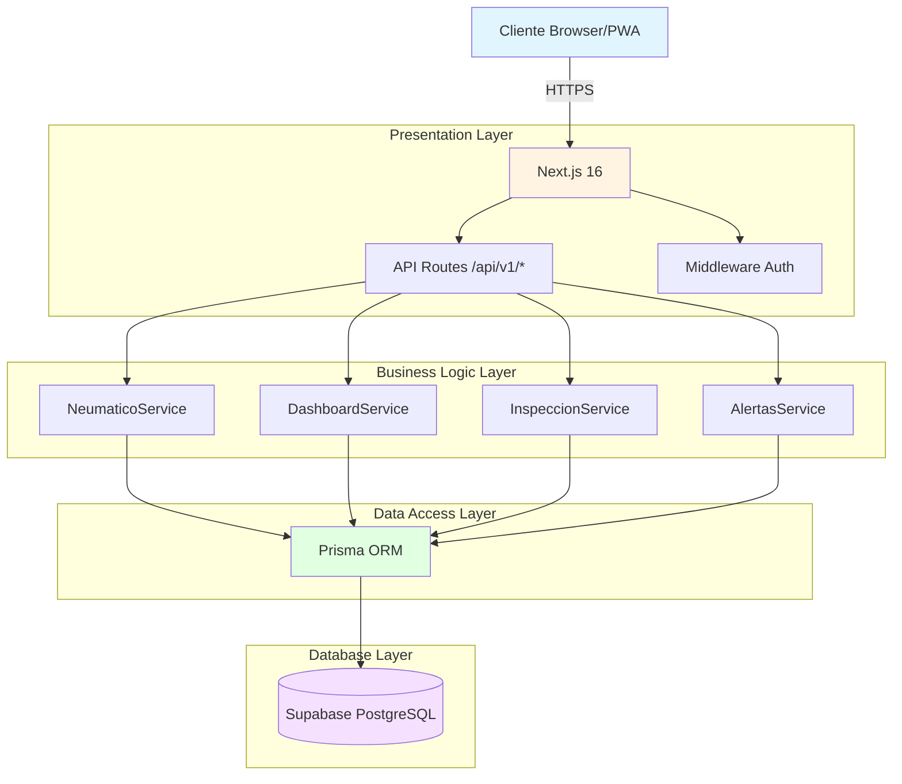

# 🏗️ Arquitectura - GesNeu API

> **Última actualización**: Diciembre 2025

## Stack Tecnológico

| Capa | Tecnología |
|------|------------|
| **Runtime** | Node.js 20+ |
| **Framework** | Next.js 16 (App Router) |
| **Lenguaje** | TypeScript 5 (strict) |
| **ORM** | Prisma 7 |
| **Base de Datos** | PostgreSQL 15 (Supabase) |
| **Autenticación** | NextAuth.js 5 (JWT) |
| **Validación** | Zod |
| **Emails** | Resend API |
| **Deploy** | Vercel |

---

## Diagrama de Arquitectura por Capas



---

## Complejidad del Dominio

### Entidades por Módulo (37 tablas)

```
CATÁLOGOS (4 tablas):
├── proveedores (TipoProveedorEnum: 5 valores)
├── almacenes (con códigos únicos)
├── motivos_desecho (con evidencia requerida)
└── parametros_inventario (6 tipos)

VEHÍCULOS (5 tablas):
├── vehiculos (con odómetro)
├── tipos_vehiculo (maestro)
├── configuraciones_eje (por tipo)
├── posiciones_neumatico (4 lados)
└── registros_odometro (histórico)

NEUMÁTICOS (6 tablas):
├── neumaticos (entidad principal)
├── modelos_neumatico (especificaciones)
├── fabricantes_neumatico (maestro)
├── especificaciones_desgaste (técnico)
├── parametros_rendimiento (IA/ML futuro)
└── modelos_posiciones_permitidas (restricciones)

OPERACIONES (8 tablas):
├── eventos_neumaticos (11 tipos de evento)
├── historial_estados (trazabilidad)
├── lecturas_presion (inspecciones)
├── inventario_neumaticos (stock)
├── movimientos_inventario (traslados)
├── garantias_neumaticos (gestión)
├── alertas (sistema proactivo)
└── bitacora_operaciones (auditoría)

SISTEMA (14 tablas):
├── usuarios + roles + permisos (RBAC)
├── auditoria_log (trazabilidad)
├── parametros_sistema (config)
└── [otras de soporte]
```

### Enums del Dominio (15)

| Enum | Valores | Uso |
|------|---------|-----|
| `EstadoNeumaticoEnum` | 6 | Ciclo de vida |
| `TipoEventoNeumaticoEnum` | 11 | Operaciones |
| `EstadoOperacionEnum` | 5 | Workflow |
| `TipoProveedorEnum` | 5 | Catálogo |
| `LadoVehiculoEnum` | 4 | Posiciones |
| `TipoEjeEnum` | 6 | Configuración |
| `NivelSeveridadEnum` | 3 | Alertas |
| `EstadoAlertaEnum` | 3 | Gestión alertas |

---

## Estructura del Proyecto

```
src/
├── app/
│   ├── api/v1/
│   │   ├── neumaticos/      # CRUD + eventos
│   │   ├── vehiculos/       # CRUD + montaje
│   │   ├── catalogos/       # Proveedores, almacenes
│   │   ├── dashboard/       # KPIs, reportes
│   │   ├── alertas/         # Gestión alertas
│   │   ├── inspecciones/    # Lecturas presión
│   │   └── webhooks/        # Integración ERP
│   ├── (pages)/             # UI Dashboard
│   └── layout.tsx
│
├── lib/
│   ├── auth/                # NextAuth config
│   │   ├── config.ts
│   │   └── authorization.ts
│   ├── services/            # Business Logic
│   │   ├── neumatico.service.ts
│   │   ├── dashboard.service.ts
│   │   ├── inspeccion.service.ts
│   │   └── webhook.service.ts
│   ├── validators/          # Zod schemas
│   └── utils/
│       └── api-response.ts
│
├── components/              # React UI
└── types/                   # TypeScript types
```

---

## Patrones de Diseño

### API Routes
- Validación con Zod en entrada
- Auth con `requireAuth()` de authorization.ts
- Respuestas estandarizadas con `ApiResponseHelper`

### Servicios
- Un servicio por dominio (NeumaticoService, DashboardService)
- Transacciones Prisma para operaciones complejas
- Sin dependencia directa de HTTP Request/Response

### Eventos como Núcleo
- Todo cambio de estado pasa por `EventoNeumatico`
- Audit trail automático (`creado_por`, timestamps)
- Trazabilidad completa

---

## Decisiones Arquitectónicas (ADR)

### ADR-001: Next.js sobre Express
**Decisión**: Usar Next.js App Router en lugar de Express tradicional.  
**Razón**: Unificar frontend y API en un solo deploy, aprovechar SSR para dashboard.

### ADR-002: Prisma sobre SQL crudo
**Decisión**: Usar Prisma ORM exclusivamente.  
**Razón**: Type safety, migraciones versionadas, compatibilidad con Supabase.

### ADR-003: Eventos como núcleo
**Decisión**: Todo cambio de estado de neumático genera un `EventoNeumatico`.  
**Razón**: Trazabilidad completa, auditoría, posibilidad de replay.

### ADR-004: Database-First
**Decisión**: El esquema PostgreSQL es la fuente de verdad.  
**Razón**: 37 tablas ya optimizadas, `prisma db pull` para sincronizar.

---

## Métricas de Performance

| Métrica | Objetivo | Crítico |
|---------|----------|---------|
| API Response (p95) | <200ms | >500ms |
| DB Query (p95) | <50ms | >200ms |
| Memory | <512MB | >1GB |
| Throughput | 1000 req/min | <100 req/min |

---

*Ver también: `04_BASE_DATOS.md` para schema detallado.*
