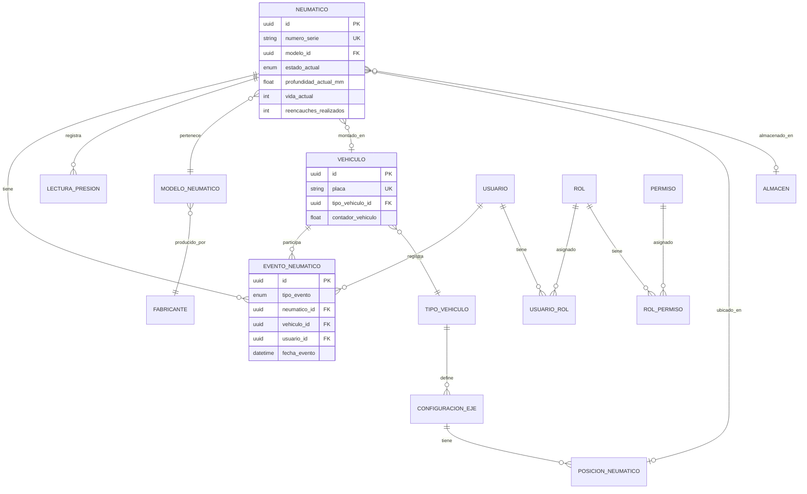

# 4. Diseño de Base de Datos

> [!CAUTION]
> **CRITICAL SCALABILITY WARNING (IoT MIGRATION)**
> El diseño actuales de tabla única para `LecturaPresion` es válido **SOLO para entrada manual**.
>
> **Si se migra a sensores TPMS automáticos:**
> 1.  El volumen de datos crecerá exponencialmente (~1.5M registros/mes para 100 vehículos).
> 2.  **ACCIÓN REQUERIDA**: Es OBLIGATORIO implementar **Particionamiento de Tablas** (Nativo Postgres `PARTITION BY RANGE` o TimescaleDB) antes de conectar el primer sensor.
> 3.  Ignorar esto causará degradación severa del sistema en <3 meses.

## ERD (Entity Relationship Diagram)API

> **Última actualización**: Diciembre 2025  
> **ORM**: Prisma 7  
> **Provider**: PostgreSQL (Supabase)

---

## Diagrama ER (Entidades Principales)



---

## Tablas por Módulo (37 total)

### Catálogos (4)
| Tabla | Descripción |
|-------|-------------|
| `proveedores` | Fabricantes, distribuidores, servicios |
| `almacenes` | Ubicaciones físicas de stock |
| `motivos_desecho` | Razones de baja |
| `parametros_inventario` | Configuración de alertas |

### Vehículos (5)
| Tabla | Descripción |
|-------|-------------|
| `vehiculos` | Flota vehicular |
| `tipos_vehiculo` | Catálogo de tipos |
| `configuraciones_eje` | Ejes por tipo de vehículo |
| `posiciones_neumatico` | Slots por eje |
| `registros_odometro` | Histórico de km |

### Neumáticos (6)
| Tabla | Descripción |
|-------|-------------|
| `neumaticos` | Entidad principal |
| `modelos_neumatico` | Especificaciones técnicas |
| `fabricantes_neumatico` | Marcas |
| `especificaciones_desgaste` | Umbrales técnicos |
| `parametros_rendimiento` | ML/Predicciones (futuro) |
| `modelos_posiciones_permitidas` | Restricciones de montaje |

### Operaciones (8)
| Tabla | Descripción |
|-------|-------------|
| `eventos_neumaticos` | Audit trail principal |
| `historial_estados` | Transiciones de estado |
| `lecturas_presion` | Inspecciones manuales/TPMS |
| `inventario_neumaticos` | Stock por almacén |
| `movimientos_inventario` | Traslados |
| `garantias_neumaticos` | Reclamaciones |
| `alertas` | Sistema proactivo |
| `bitacora_operaciones` | Auditoría general |

### Sistema (14)
| Tabla | Descripción |
|-------|-------------|
| `usuarios` | Autenticación |
| `roles` | RBAC |
| `permisos` | Granular |
| `usuarios_roles` | M:N |
| `roles_permisos` | M:N |
| `auditoria_log` | Trazabilidad |
| *...y más* | Configuración, jobs, rutas |

---

## Modelos Principales (Prisma)

### Neumatico
```prisma
model Neumatico {
  id                     String              @id @default(uuid())
  numero_serie           String              @unique
  modelo_id              String
  estado_actual          EstadoNeumaticoEnum @default(EN_STOCK)
  profundidad_inicial_mm Float
  profundidad_actual_mm  Float?
  presion_actual_psi     Float?
  vida_actual            Int                 @default(1)
  reencauches_realizados Int                 @default(0)
  es_reencauchado        Boolean             @default(false)
  kilometraje_acumulado  Float               @default(0)
  
  // Ubicación actual (solo uno a la vez)
  ubicacion_almacen_id   String?
  ubicacion_vehiculo_id  String?
  ubicacion_posicion_id  String?
  
  // Audit
  creado_por             String?
  creado_en              DateTime            @default(now())
  actualizado_por        String?
  actualizado_en         DateTime?
}
```

### EventoNeumatico
```prisma
model EventoNeumatico {
  id                  String                  @id @default(uuid())
  tipo_evento         TipoEventoNeumaticoEnum
  neumatico_id        String
  vehiculo_id         String?
  posicion_id         String?
  fecha_evento        DateTime                @default(now())
  contador_vehiculo   Float?
  profundidad_mm      Float?
  presion_psi         Float?
  observaciones       String?
  creado_por          String?
}
```

### LecturaPresion
```prisma
model LecturaPresion {
  id            String        @id @default(uuid())
  neumatico_id  String
  presion_psi   Float
  temperatura_c Float?
  fuente        FuenteLectura @default(MANUAL)
  creado_por    String?
  fecha_lectura DateTime      @default(now())
}
```

---

## Enums Clave

```prisma
enum EstadoNeumaticoEnum {
  EN_STOCK
  INSTALADO
  EN_REPARACION
  EN_REENCAUCHE
  DESECHADO
}

enum TipoEventoNeumaticoEnum {
  COMPRA
  INSTALACION
  DESMONTAJE
  ROTACION
  INSPECCION
  REPARACION_ENTRADA
  REPARACION_SALIDA
  REENCAUCHE_ENTRADA
  REENCAUCHE_SALIDA
  DESECHO
  AJUSTE_INVENTARIO
}

enum TipoProveedorEnum {
  FABRICANTE
  DISTRIBUIDOR
  SERVICIO_REPARACION
  SERVICIO_REENCAUCHE
  OTRO
}

enum FuenteLectura {
  MANUAL
  SENSOR_TPMS
}

enum TipoEjeEnum {
  DIRECCION
  TRACCION
  ARRASTRE // Ejes libres de carretas
}
```

---

## Relaciones Complejas

| Relación | Niveles | Descripción |
|----------|---------|-------------|
| Neumático → Modelo → Fabricante | 3 | Jerarquía de producto |
| Vehículo → Tipo → Eje → Posición | 4 | Configuración física |
| Usuario → Roles → Permisos | 3 | RBAC |
| Evento → Neumático → Vehículo → Posición | 4 | Trazabilidad completa |

---

## Comandos de Migración

```bash
# Desarrollo: crear migración
npx prisma migrate dev --name descripcion

# Producción: aplicar migraciones
npx prisma migrate deploy

# Sync desde DB existente
npx prisma db pull

# Regenerar cliente
npx prisma generate
```

> ⚠️ **NUNCA usar `migrate dev` en producción** - destruye datos.

---

## RLS (Row Level Security)

Supabase tiene RLS habilitado. Políticas principales:
- Usuarios solo ven datos según permisos de rol
- Operadores no pueden eliminar registros
- Audit logs son append-only

---

*Ver schema completo en `prisma/schema.prisma`.*
