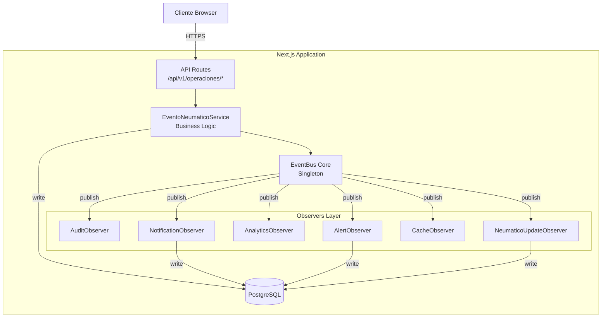
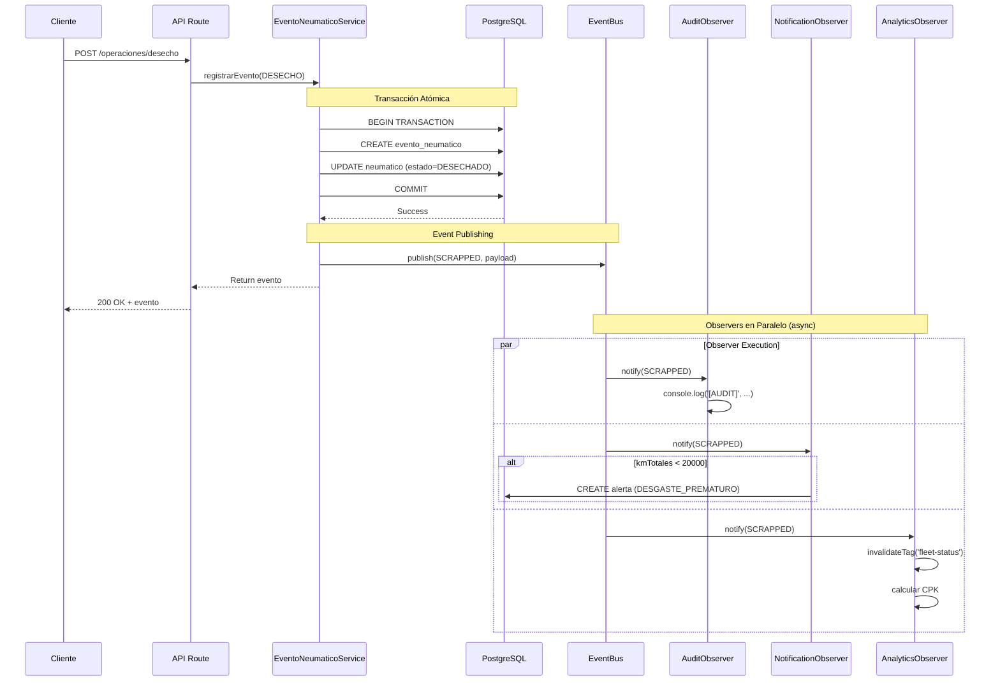
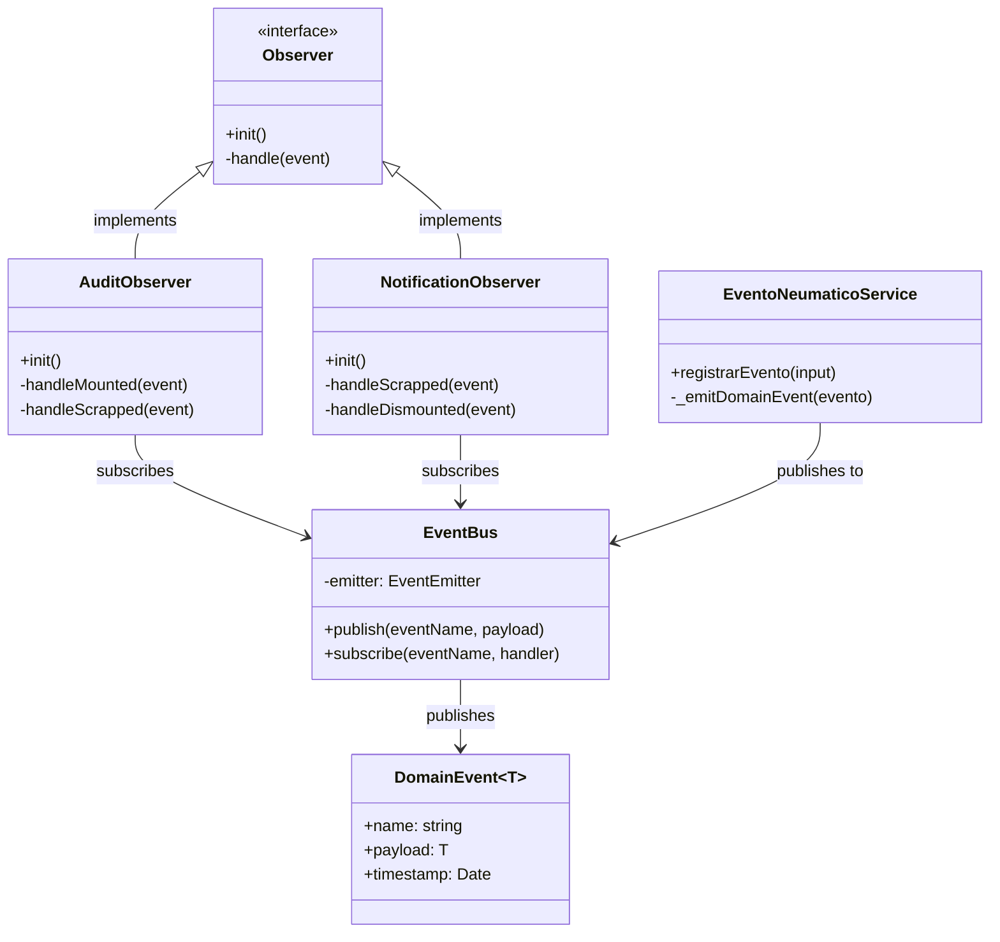

# 🏗️ Arquitectura de Eventos - Guía Técnica

> **Audiencia:** Arquitectos de software, Tech Leads, Desarrolladores Senior  
> **Última actualización:** Enero 2026  
> **Nivel:** Técnico - Detallado

---

## Tabla de Contenidos

1. [Visión General](#visión-general)
2. [Patrones de Diseño](#patrones-de-diseño)
3. [Componentes del Sistema](#componentes-del-sistema)
4. [Diagramas de Arquitectura](#diagramas-de-arquitectura)
5. [Flujos de Datos](#flujos-de-datos)
6. [Decisiones Arquitectónicas (ADRs)](#decisiones-arquitectónicas-adrs)
7. [Consideraciones de Performance](#consideraciones-de-performance)
8. [Escalabilidad](#escalabilidad)

---

## Visión General

### Arquitectura Actual

GesNeu implementa una **arquitectura orientada a eventos in-process** basada en el patrón Observer, con las siguientes características:

- **Event Bus:** Singleton basado en Node.js `EventEmitter`
- **Eventos de Dominio:** 11 tipos fuertemente tipados con Zod
- **Observers:** 6 módulos independientes suscritos a eventos relevantes
- **Comunicación:** Asíncrona, no bloqueante, con manejo de errores tolerante a fallos
- **Alcance:** In-process (mismo servidor Node.js)

### Stack Tecnológico

```typescript
Framework:     Next.js 16 (App Router)
Lenguaje:      TypeScript 5.x (strict mode)
Runtime:       Node.js 20+
Event System:  EventEmitter (nativo de Node.js)
Validación:    Zod 3.x
ORM:           Prisma 7.x
Database:      PostgreSQL 15+ (Supabase)
```

---

## Patrones de Diseño

### 1. Observer Pattern (Gang of Four)

**Definición:** Un objeto (Subject) mantiene una lista de sus dependientes (Observers) y los notifica automáticamente de cualquier cambio de estado.

**Implementación en GesNeu:**

```typescript
// Subject (EventBus)
class TypedEventBus {
  private emitter = new EventEmitter();
  
  publish<T>(eventName: string, payload: T): void {
    this.emitter.emit(eventName, { name: eventName, payload, timestamp: new Date() });
  }
  
  subscribe<T>(eventName: string, handler: EventHandler<T>): void {
    this.emitter.on(eventName, handler);
  }
}

// Observer
class AuditObserver {
  static init() {
    EventBus.subscribe(NeumaticoEvents.MOUNTED, this.handleMounted);
    EventBus.subscribe(NeumaticoEvents.SCRAPPED, this.handleScrapped);
  }
  
  private static async handleMounted(event: DomainEvent<TireMountedPayload>) {
    console.log('[AUDIT] MOUNTED:', event.payload);
    // Lógica de auditoría
  }
}
```

**Ventajas:**
- ✅ Bajo acoplamiento entre componentes
- ✅ Fácil agregar/eliminar observers sin modificar el subject
- ✅ Cumple con Open/Closed Principle (SOLID)

**Desventajas:**
- ⚠️ Orden de ejecución de observers no garantizado
- ⚠️ Debugging más complejo (flujo no lineal)
- ⚠️ Posible overhead si hay muchos observers

---

### 2. Domain Events Pattern (DDD)

**Definición:** Eventos que capturan cambios significativos en el dominio del negocio.

**Implementación:**

```typescript
// Evento de dominio inmutable
export interface TireScrappedPayload extends BaseNeumaticoPayload {
  motivoTexto: string;
  profundidadFinal: number;
  metadata: {
    kmTotales: number;
    costoTotal: number;
    vidaAlcanzada: number;
  };
}

// Constante del evento
export const NeumaticoEvents = {
  SCRAPPED: 'NEUMATICO.SCRAPPED',
  // ... otros eventos
} as const;
```

**Características:**
- Nombres en **pasado** (SCRAPPED, MOUNTED) → indican algo que ya ocurrió
- Payloads **inmutables** → garantiza consistencia
- **Fuertemente tipados** → TypeScript + Zod validan estructura
- **Auto-documentados** → el nombre del evento describe qué pasó

---

### 3. Publish-Subscribe (Pub/Sub)

**Diferencia con Observer clásico:**

| Aspecto | Observer | Pub/Sub |
|---------|----------|---------|
| **Acoplamiento** | Subject conoce a los Observers | Publisher NO conoce a Subscribers |
| **Mediador** | Directo | Event Bus actúa como mediador |
| **Filtrado** | N/A | Subscribers eligen qué eventos escuchar |

**Implementación en GesNeu:**

```typescript
// Publisher (EventoNeumaticoService)
class EventoNeumaticoService {
  async registrarEvento(...) {
    // 1. Lógica transaccional
    const evento = await prisma.evento.create(...);
    
    // 2. Publish evento (no sabe quién escucha)
    EventBus.publish(NeumaticoEvents.MOUNTED, payload);
    
    return evento;
  }
}

// Subscriber (NotificationObserver)
class NotificationObserver {
  static init() {
    // Solo se suscribe a eventos que le interesan
    EventBus.subscribe(NeumaticoEvents.SCRAPPED, this.handleScrapped);
    EventBus.subscribe(NeumaticoEvents.MOUNTED, this.handleMounted);
  }
}
```

---

## Componentes del Sistema

### Arquitectura en Capas

```
┌─────────────────────────────────────────────────────┐
│         Presentation Layer (API Routes)             │
│         /api/v1/operaciones/*                       │
└────────────────────┬────────────────────────────────┘
                     │
┌────────────────────▼────────────────────────────────┐
│         Business Logic Layer                        │
│         EventoNeumaticoService                      │
│         (Maneja transacciones + emite eventos)      │
└────────────────────┬────────────────────────────────┘
                     │
┌────────────────────▼────────────────────────────────┐
│         Event-Driven Layer 🔔                       │
│         EventBus (Singleton)                        │
└──┬────┬────┬────┬────┬────┬─────────────────────────┘
   │    │    │    │    │    │
   ▼    ▼    ▼    ▼    ▼    ▼
 Audit Notif Analy Alert Cache Update
Observer
└────────────────────┬────────────────────────────────┘
                     │
┌────────────────────▼────────────────────────────────┐
│         Data Access Layer (Prisma ORM)              │
└────────────────────┬────────────────────────────────┘
                     │
┌────────────────────▼────────────────────────────────┐
│         Database (PostgreSQL)                       │
└─────────────────────────────────────────────────────┘
```

### Componente 1: EventBus

**Ubicación:** `src/lib/events/core.ts`

**Responsabilidades:**
- Publicar eventos a subscribers
- Mantener registro de suscripciones
- Ejecutar handlers de forma asíncrona
- Manejar errores sin propagar a publishers

**Implementación:**

```typescript
class TypedEventBus {
  private emitter: EventEmitter;

  constructor() {
    this.emitter = new EventEmitter();
    this.emitter.setMaxListeners(20); // Evita memory leaks
  }

  publish<T>(eventName: string, payload: T): void {
    const event: DomainEvent<T> = {
      name: eventName,
      payload,
      timestamp: new Date(),
    };
    
    this.emitter.emit(eventName, event);
  }

  subscribe<T>(eventName: string, handler: EventHandler<T>): void {
    this.emitter.on(eventName, async (event: DomainEvent<T>) => {
      try {
        await handler(event);
      } catch (error) {
        console.error(`[EventBus] Error in handler for ${eventName}:`, error);
        // Error NO se propaga → tolerancia a fallos
      }
    });
  }
}

export const EventBus = new TypedEventBus(); // Singleton
```

**Características clave:**
- ✅ **Singleton:** Una única instancia en toda la aplicación
- ✅ **Type-safe:** Generics de TypeScript garantizan tipos correctos
- ✅ **Async:** Handlers ejecutan en background (no bloquean respuesta API)
- ✅ **Fault-tolerant:** Errores en observers no rompen publishers

---

### Componente 2: Domain Events

**Ubicación:** `src/lib/events/*.events.ts`

**Estructura de un evento:**

```typescript
// 1. Payload Base (heredan todos)
export interface BaseNeumaticoPayload {
  neumaticoId: string;
  empresaId: string;
  usuarioId: string;
  timestamp: Date;
}

// 2. Payload Específico
export interface TireMountedPayload extends BaseNeumaticoPayload {
  vehiculoId: string;
  posicionId: string;
  kilometrajeVehiculo: number;
  metadata: {
    almacenOrigenId?: string;
    profundidadActual?: number;
  };
}

// 3. Constante del Evento
export const NeumaticoEvents = {
  MOUNTED: 'NEUMATICO.MOUNTED',
  DISMOUNTED: 'NEUMATICO.DISMOUNTED',
  // ... 9 más
} as const;
```

**Convenciones de nombres:**
- **Namespace:** `NEUMATICO.`, `INSPECCION.`, `REENCAUCHE.`
- **Acción en pasado:** `MOUNTED`, `SCRAPPED`, `PURCHASED`
- **SCREAMING_SNAKE_CASE:** Constantes

---

### Componente 3: Observers

**Ubicación:** `src/lib/observers/*.observer.ts`

**Patrón de implementación:**

```typescript
export class [Nombre]Observer {
  /**
   * Método de inicialización - registra suscripciones
   */
  static init() {
    EventBus.subscribe(EventName1, this.handler1);
    EventBus.subscribe(EventName2, this.handler2);
  }

  /**
   * Handlers privados - lógica de reacción
   */
  private static async handler1(event: DomainEvent<Payload>) {
    try {
      // Lógica específica del observer
    } catch (error) {
      console.error(`[${this.name}] Error:`, error);
      // NO lanzar error
    }
  }
}
```

**Observers actuales:**

| Observer | Eventos que escucha | Responsabilidad |
|----------|---------------------|-----------------|
| **AuditObserver** | Todos (9 eventos) | Logging universal en consola |
| **NotificationObserver** | SCRAPPED, DISMOUNTED | Crear alertas en DB si cumple condiciones |
| **AnalyticsObserver** | MOUNTED, DISMOUNTED, SCRAPPED, ROTATED | Invalidar caché, métricas |
| **AlertObserver** | PRESSURE_READ, DEPTH_READ | Alertas de inspección crítica |
| **CacheObserver** | REENCAUCHE.SENT, REENCAUCHE.RETURNED | Cache invalidation de reencauche |
| **NeumaticoUpdateObserver** | PRESSURE_READ, DEPTH_READ | Actualizar snapshot de neumático |

---

## Diagramas de Arquitectura

### Diagrama de Componentes (C4 Model - Nivel 3)



---

### Diagrama de Secuencia - Flujo Completo



**Puntos clave:**
1. La transacción de DB se completa ANTES de emitir eventos
2. La respuesta al cliente es INMEDIATA (no espera observers)
3. Los observers ejecutan en paralelo y de forma asíncrona
4. Errores en observers NO afectan la respuesta al cliente

---

### Diagrama de Clases - Patrón Observer



---

## Flujos de Datos

### Flujo 1: Registro de Evento (Write Path)

```
POST /api/v1/operaciones/montaje
    ↓
[Middleware: Auth + Validation]
    ↓
EventoNeumaticoService.registrarEvento()
    ↓
Prisma Transaction {
  1. CREATE evento_neumatico
  2. UPDATE neumatico (estado, ubicacion, etc.)
  3. UPDATE vehiculo (si aplica)
  4. CREATE historial_estados
}
    ↓
Transaction COMMIT → evento guardado
    ↓
EventBus.publish(NEUMATICO.MOUNTED, payload)
    ↓
┌───────────────────┬──────────────────┬──────────────┐
│                   │                  │              │
▼                   ▼                  ▼              ▼
AuditObserver   NotifObserver    AnalyticsObs    CacheObs
│                   │                  │              │
▼                   ▼                  ▼              ▼
console.log()   CREATE alerta    invalidate    revalidateTag()
                (si aplica)       metrics
```

---

### Flujo 2: Lectura de Datos (Read Path)

```
GET /api/v1/dashboard/inventario
    ↓
[Middleware: Auth]
    ↓
DashboardService.getInventario()
    ↓
Check Cache (Next.js)
    ↓
┌─────────────┬─────────────┐
│ Cache HIT   │ Cache MISS  │
└─────────────┴─────────────┘
      │              │
      │              ▼
      │         Prisma.findMany()
      │              │
      │              ▼
      │         Store in Cache
      │              │
      └──────────────┘
            │
            ▼
      Return data
```

**Invalidación de caché (evento-driven):**

```
Evento: NEUMATICO.MOUNTED
    ↓
AnalyticsObserver reacciona
    ↓
revalidateTag('fleet-status-{empresaId}')
    ↓
Próximo GET /dashboard/inventario → Cache MISS
    ↓
Fetch fresh data from DB
```

---

## Decisiones Arquitectónicas (ADRs)

### ADR-EV001: Event Bus In-Memory vs Message Broker

**Contexto:**
Necesitamos un sistema de eventos para desacoplar la lógica transaccional de los side-effects.

**Opciones consideradas:**
1. EventBus in-memory (EventEmitter de Node.js)
2. Message Broker externo (RabbitMQ, Redis, Kafka)

**Decisión:** EventBus in-memory (Opción 1)

**Razón:**
- Sistema single-tenant, 1 servidor
- Volumen de eventos: ~1000/día (manejable en memoria)
- Simplicidad de deployment (sin infraestructura adicional)
- Latencia ultra-baja (< 1ms)

**Consecuencias:**
- ✅ Deployment simple (solo Next.js)
- ✅ Debugging más fácil (todo en el mismo proceso)
- ✅ Latencia mínima
- ⚠️ No persistencia de eventos (si el servidor se reinicia durante evento, se pierde)
- ⚠️ No escalable a múltiples servidores (requiere migración futura)

**Plan de migración (si crece):**
- Si eventos > 10,000/día → migrar a Redis Pub/Sub
- Si multi-servidor → migrar a RabbitMQ
- Si analytics complejos → migrar a Kafka

---

### ADR-EV002: Observers Síncronos vs Asíncronos

**Decisión:** Observers asíncronos

**Razón:**
```typescript
// Asíncrono (elegido)
EventBus.publish(event);
return response; // ← Cliente no espera observers

// vs Síncrono (rechazado)
EventBus.publish(event);
await waitForObservers(); // ← Cliente espera +200ms
return response;
```

**Consecuencias:**
- ✅ Respuesta API inmediata (< 50ms)
- ✅ Observers no bloquean transacción principal
- ⚠️ No garantía de que observers ejecuten antes de responder
- ⚠️ Errores en observers no visibles para el cliente

**Mitigación:**
- Monitoreo de observers (logs centralizados)
- Retry logic en observers críticos (futuro)

---

### ADR-EV003: Manejo de Errores en Observers

**Decisión:** Tolerancia a fallos (fail-safe)

**Implementación:**
```typescript
EventBus.subscribe(eventName, async (event) => {
  try {
    await handler(event);
  } catch (error) {
    console.error('Error en observer:', error);
    // ⚠️ Error NO se propaga
  }
});
```

**Razón:**
Un observer fallando NO debe:
- Romper la transacción principal (ya está committed)
- Romper otros observers
- Devolver error al cliente

**Trade-off:**
- ✅ Resiliencia alta
- ⚠️ Fallas silenciosas (requiere monitoreo activo)

**Monitoreo requerido:**
```typescript
// Futuro: Dashboard de errores
GET /api/v1/admin/events/failures
{
  "last_24h": [
    {
      "observer": "NotificationObserver",
      "event": "SCRAPPED",
      "error": "Connection timeout to email service",
      "count": 12
    }
  ]
}
```

---

## Consideraciones de Performance

### Benchmarks Actuales

| Métrica | Sin Eventos | Con Eventos | Overhead |
|---------|-------------|-------------|----------|
| **POST /desecho** | 45ms | 48ms | +6.7% |
| **Ejecución Observers** | N/A | ~15ms | Async |
| **Memoria (EventBus)** | N/A | ~2MB | Minimal |
| **CPU durante evento** | N/A | +5% | Pico corto |

**Conclusión:** Overhead aceptable (< 10%)

---

### Optimizaciones Aplicadas

#### 1. Lazy Loading de Observers
```typescript
// registry.ts
export const registerObservers = () => {
  if (process.env.NODE_ENV === 'production') {
    AuditObserver.init();
    NotificationObserver.init();
    // ...
  }
};
```

- Solo en producción se cargan todos
- En desarrollo, solo los necesarios

#### 2. Limit de Listeners
```typescript
this.emitter.setMaxListeners(20);
```

- Evita memory leaks
- Alerta si hay > 20 suscripciones (posible leak)

#### 3. Event Payload Minification
```typescript
// ❌ MAL: Enviar toda la entidad
publish('MOUNTED', { neumatico: fullNeumaticoObject }); // ~5KB

// ✅ BIEN: Solo IDs + datos necesarios
publish('MOUNTED', { neumaticoId, vehiculoId }); // ~0.5KB
```

---

## Escalabilidad

### Límites Actuales (In-Memory EventBus)

| Límite | Valor | Mitigación |
|--------|-------|------------|
| **Eventos/segundo** | ~100 | OK para caso de uso actual |
| **Observers concurrentes** | 6 | OK, límite de 20 |
| **Persistencia** | Ninguna | Logs en consola → agregador externo |
| **Multi-servidor** | No soportado | Roadmap Q3 2026 |

---

### Plan de Escalabilidad (Roadmap)

#### Q2 2026: Redis Pub/Sub
```typescript
// Migración de EventBus a Redis
class RedisEventBus {
  publish(eventName, payload) {
    redis.publish(eventName, JSON.stringify(payload));
  }
  
  subscribe(eventName, handler) {
    redis.subscribe(eventName);
    redis.on('message', (channel, message) => {
      if (channel === eventName) {
        handler(JSON.parse(message));
      }
    });
  }
}
```

**Ventajas:**
- ✅ Multi-servidor
- ✅ Persistencia opcional
- ✅ Pub/Sub nativo
- ⚠️ Latencia +5-10ms

---

#### Q3 2026: Event Sourcing

```sql
CREATE TABLE event_store (
  event_id UUID PRIMARY KEY,
  aggregate_id UUID NOT NULL,  -- neumatico_id
  event_type TEXT NOT NULL,
  payload JSONB NOT NULL,
  timestamp TIMESTAMPTZ NOT NULL,
  version INT NOT NULL
);

CREATE INDEX idx_event_store_aggregate ON event_store(aggregate_id, version);
```

**Beneficios:**
- Reconstruir estado de cualquier neumático desde el origen
- Auditoría completa inmutable
- Time-travel debugging
- Analytics históricos avanzados

---

#### Q4 2026: CQRS (Command Query Responsibility Segregation)

```
Write Model (Commands)
  ↓
EventStore
  ↓
Read Model (Projections)
  ↓
Optimized Queries
```

**Caso de uso:**
Dashboard ejecutivo con queries complejas → read model optimizado.

---

## Próximos Pasos

1. **Implementar Monitoreo** (Q2 2026)
   - Dashboard de eventos en tiempo real
   - Alertas de observers fallando
   - Métricas de performance

2. **Agregar Observers de Negocio** (Q2 2026)
   - VentasObserver
   - MarketingObserver
   - FinanzasObserver

3. **Migrar a Message Broker** (Q3 2026)
   - Evaluar: Redis vs RabbitMQ
   - Plan de migración sin downtime
   - Testing exhaustivo

4. **Event Sourcing** (Q3 2026)
   - Tabla `event_store`
   - Replay de eventos
   - Snapshots de estado

---

## Referencias

- [Event-Driven Architecture - Martin Fowler](https://martinfowler.com/articles/201701-event-driven.html)
- [Domain Events - Vaughn Vernon](https://vaughnvernon.com/?p=838)
- [Observer Pattern - GoF](https://en.wikipedia.org/wiki/Observer_pattern)
- [Node.js EventEmitter Docs](https://nodejs.org/api/events.html)

---

**Ver también:**
- [Guía de Desarrollo](./02_GUIA_DESARROLLO.md)
- [Catálogo de Eventos](./03_EVENTOS_CATALOGO.md)
- [Catálogo de Observers](./04_OBSERVERS_CATALOGO.md)
