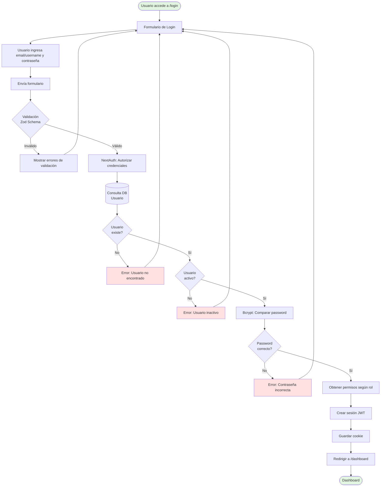
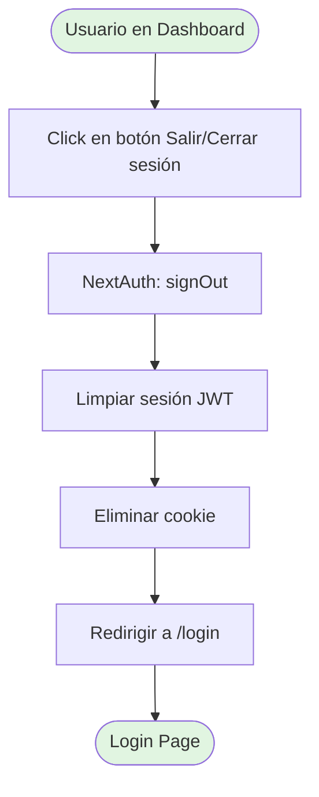
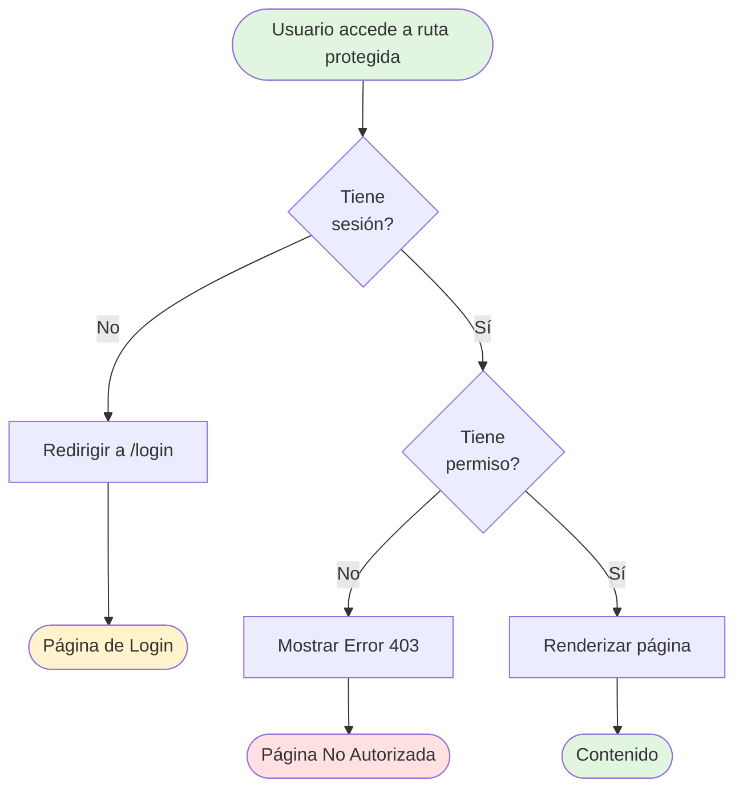
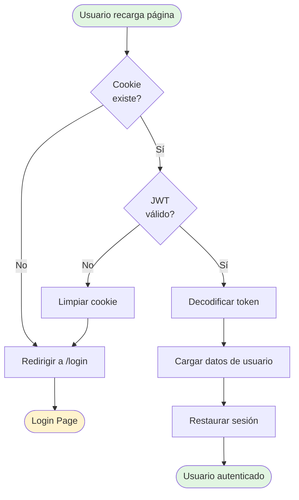

# Authentication Flow

Este diagrama muestra el flujo completo de autenticación en GesNeu API.

## Flujo de Login



## Flujo de Logout



## Flujo de Protección de Rutas



## Persistencia de Sesión



## Componentes Clave

### Backend
- **`src/lib/auth/auth.ts`**: Configuración NextAuth
- **`src/lib/auth/config.ts`**: Callbacks JWT y sesión
- **`src/lib/auth/authorization.ts`**: Middleware de autorización

### Frontend
- **`src/app/(auth)/login/page.tsx`**: Página de login
- **`src/components/auth/`**: Componentes de autenticación

### Database
- **`schema.prisma`**: Usuario table con password_hash

## Variables de Entorno Requeridas

```env
NEXTAUTH_SECRET=<secret-key>
AUTH_SECRET=<secret-key>
AUTH_TRUST_HOST=true
DATABASE_URL=<postgres-url>
```

## Seguridad

✅ **Bcrypt** para hashing de contraseñas  
✅ **JWT** para sesiones stateless  
✅ **CSRF Protection** activado  
✅ **HTTP-only cookies** para prevenir XSS  
✅ **Role-Based Access Control** (RBAC)
