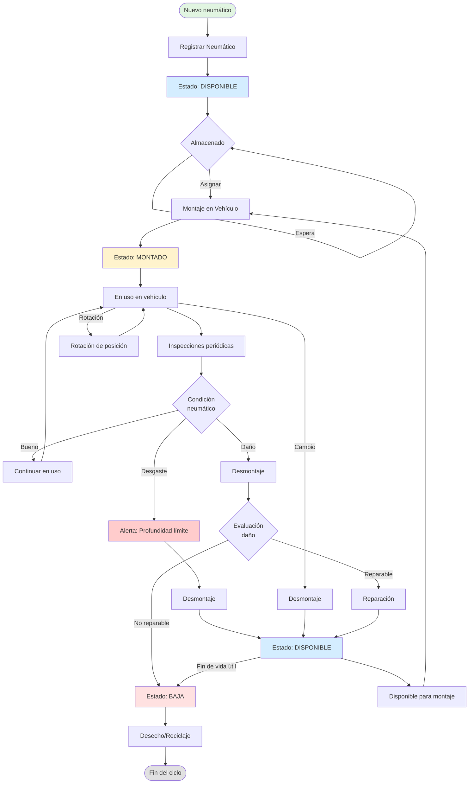
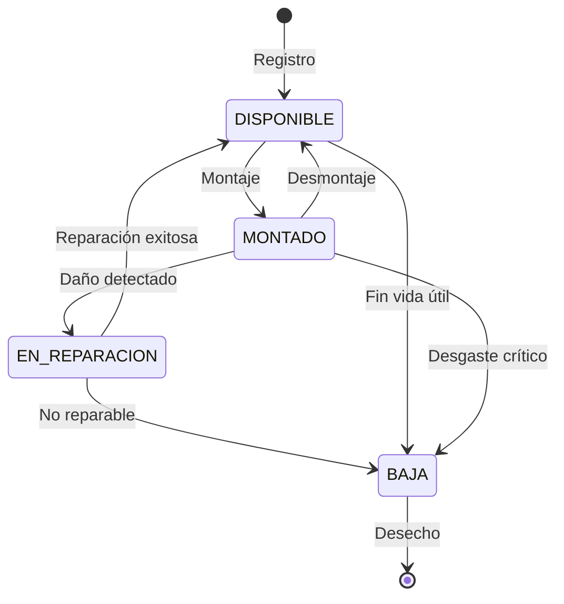
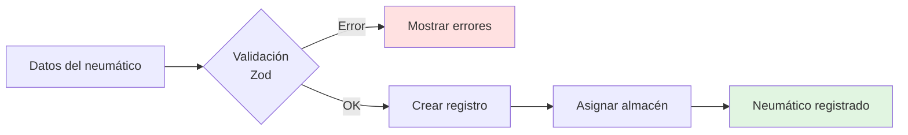
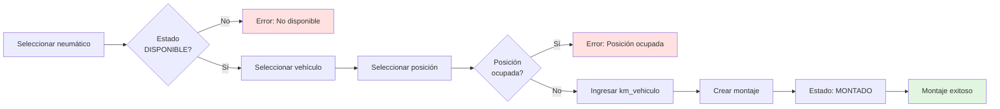
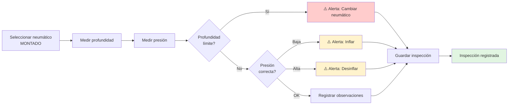
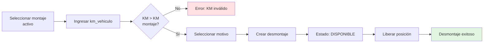
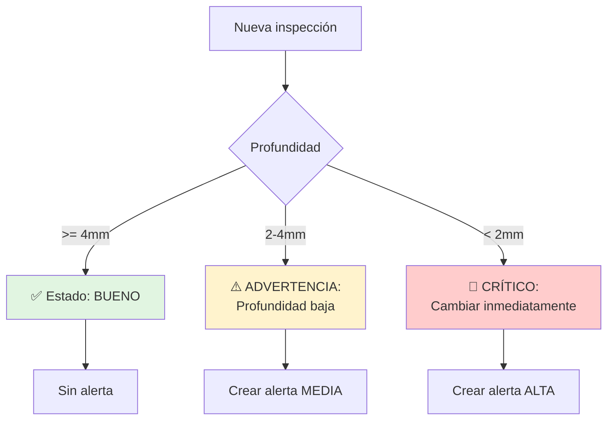
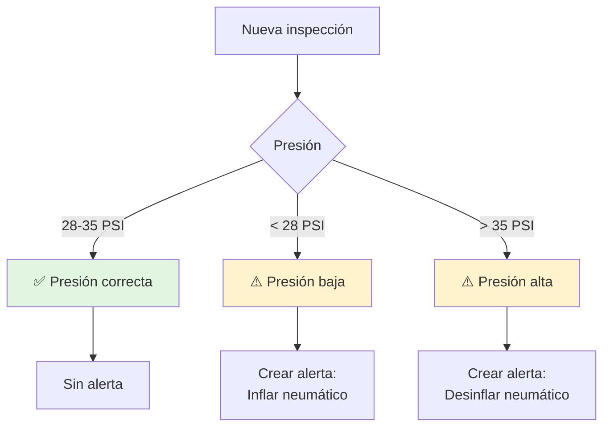

# Ciclo de Vida de Neumáticos

Este diagrama muestra el flujo completo del ciclo de vida de un neumático en GesNeu desde su registro hasta su baja.

## Flujo Completo



## Estados del Neumático



## Operaciones Principales

### 1. Registro



### 2. Montaje



### 3. Inspección



### 4. Desmontaje



## Alertas y Validaciones

### Alertas de Profundidad



### Alertas de Presión



## Archivos Relacionados

### Backend
- **`src/lib/services/neumatico.service.ts`**: Lógica de negocio
- **`src/lib/services/evento-neumatico.service.ts`**: Montaje, desmontaje, inspección
- **`src/lib/repositories/neumatico.repository.ts`**: Data access
- **`src/lib/validators/neumatico.validator.ts`**: Validaciones Zod

### Frontend
- **`src/app/(dashboard)/dashboard/neumaticos/`**: CRUD neumáticos
- **`src/app/(dashboard)/dashboard/operaciones/`**: Montaje, inspección, desmontaje

### Database
```prisma
model Neumatico {
  id                String   @id @default(uuid())
  numero_serie      String   @unique
  estado            EstadoNeumatico
  profundidad_actual Float
  // ... más campos
}

enum EstadoNeumatico {
  DISPONIBLE
  MONTADO
  EN_REPARACION
  BAJA
}
```

## Métricas Clave

- **Vida útil promedio**: Calculada en km recorridos
- **Tasa de inspecciones**: Inspecciones/mes por neumático
- **Alertas activas**: Neumáticos que requieren atención
- **Rotación**: Tiempo promedio entre montaje y desmontaje
