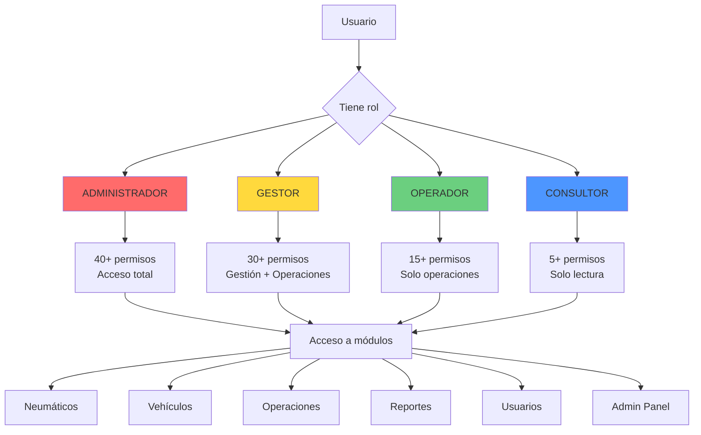
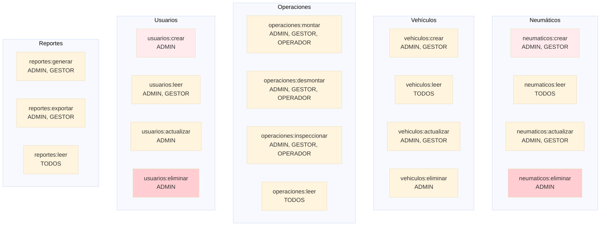
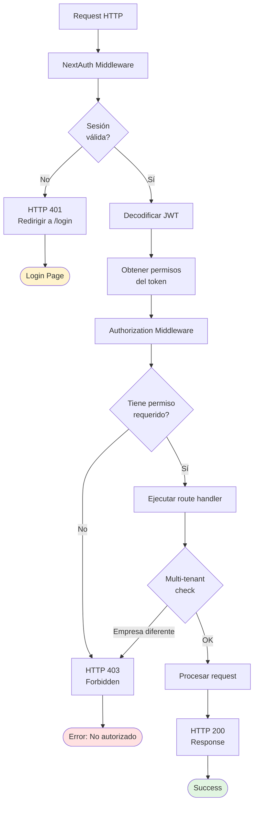
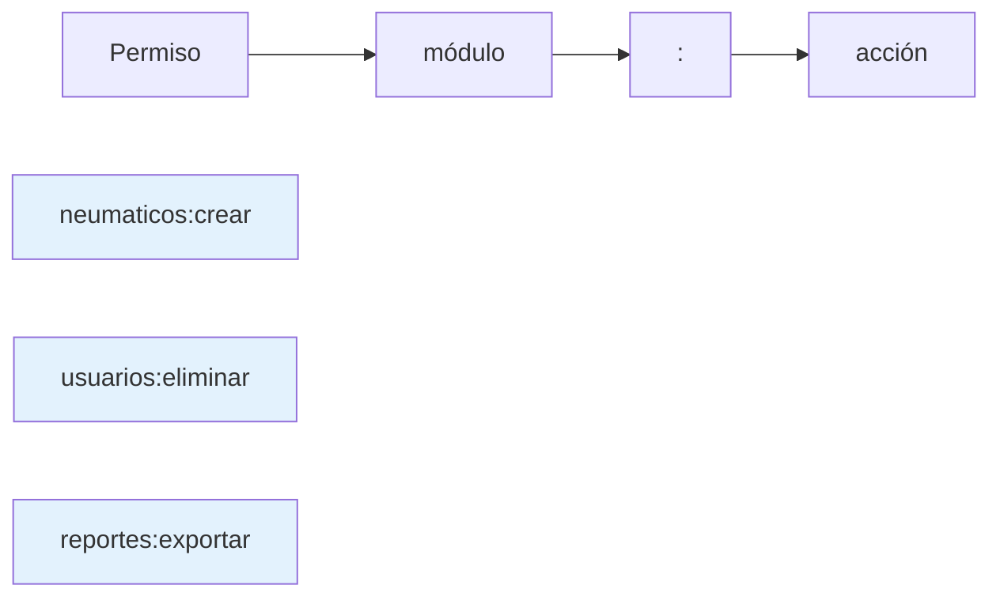
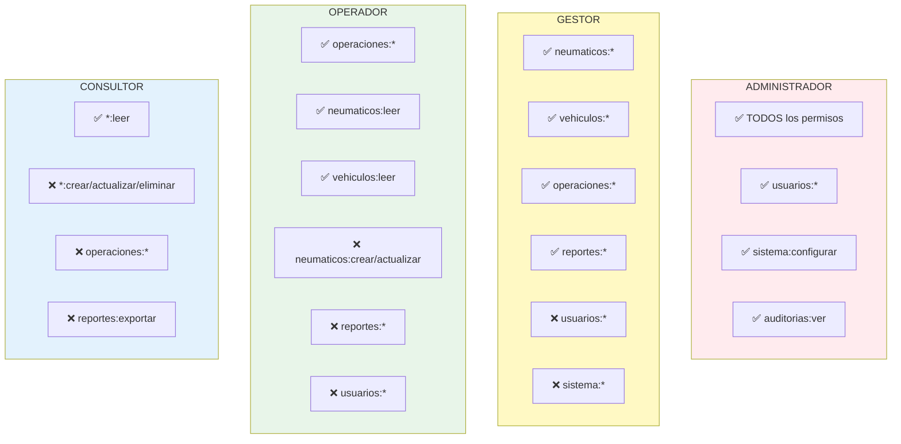
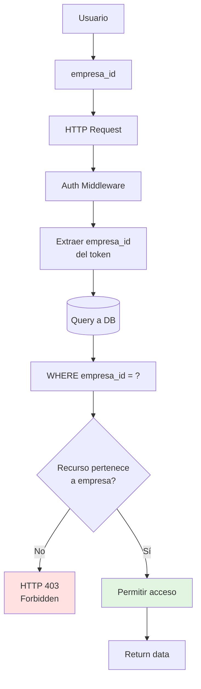
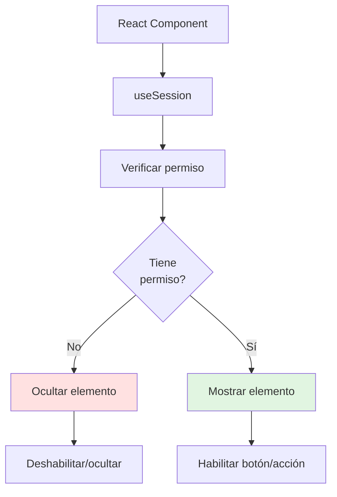
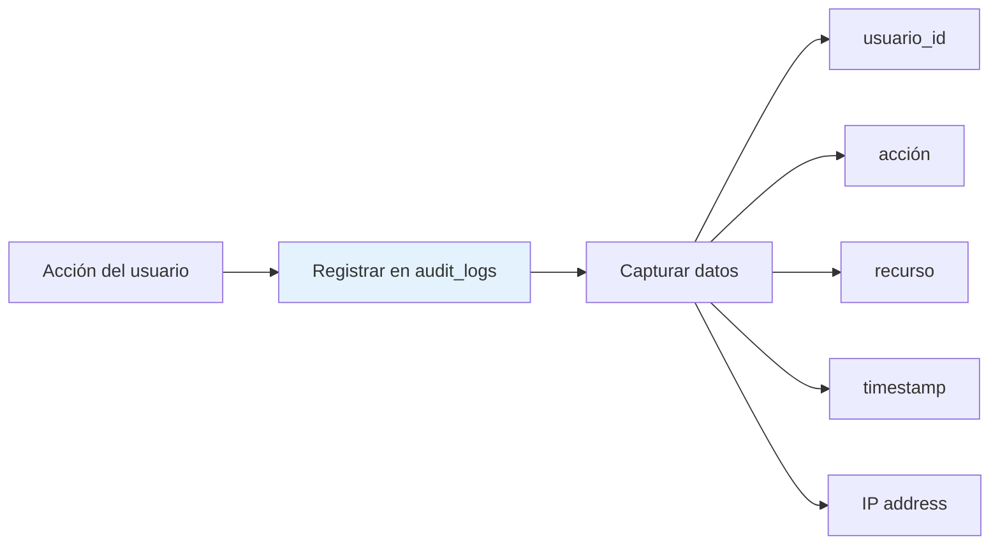

# Sistema RBAC (Role-Based Access Control)

Este diagrama muestra la estructura de roles, permisos y autorización en GesNeu API.

## Arquitectura RBAC



## Roles y Permisos

### Matriz de Permisos por Módulo



## Flujo de Autorización



## Estructura de Permisos

### Formato de Permisos



### Permisos por Rol



## Multi-Tenancy



## Implementación en Código

### Archivo: `src/lib/auth/permissions.ts`

```typescript
// Definición de roles
export const ROLES = {
  ADMINISTRADOR: 'ADMINISTRADOR',
  GESTOR: 'GESTOR',
  OPERADOR: 'OPERADOR',
  CONSULTOR: 'CONSULTOR'
} as const;

// Permisos por módulo
export const PERMISSIONS = {
  neumaticos: ['crear', 'leer', 'actualizar', 'eliminar'],
  vehiculos: ['crear', 'leer', 'actualizar', 'eliminar'],
  operaciones: ['montar', 'desmontar', 'inspeccionar', 'leer'],
  usuarios: ['crear', 'leer', 'actualizar', 'eliminar'],
  reportes: ['generar', 'exportar', 'leer']
};

// Mapeo de permisos por rol
export const ROLE_PERMISSIONS = {
  ADMINISTRADOR: ['*:*'], // Todos los permisos
  GESTOR: [
    'neumaticos:*',
    'vehiculos:*',
    'operaciones:*',
    'reportes:*'
  ],
  OPERADOR: [
    'neumaticos:leer',
    'vehiculos:leer',
    'operaciones:*'
  ],
  CONSULTOR: ['*:leer']
};
```

### Archivo: `src/lib/auth/authorization.ts`

```typescript
// Middleware de autorización
export function requirePermission(permission: string) {
  return async (req: Request) => {
    const session = await getSession(req);
    
    if (!session) {
      return new Response('Unauthorized', { status: 401 });
    }
    
    if (!hasPermission(session.user.permissions, permission)) {
      return new Response('Forbidden', { status: 403 });
    }
    
    return null; // Permitir acceso
  };
}

// Verificar permiso
function hasPermission(userPermissions: string[], required: string): boolean {
  // Check for wildcard permission
  if (userPermissions.includes('*:*')) return true;
  
  const [module, action] = required.split(':');
  
  // Check for module wildcard
  if (userPermissions.includes(`${module}:*`)) return true;
  
  // Check for exact permission
  return userPermissions.includes(required);
}
```

## UI Condicional por Rol



### Ejemplo en React

```typescript
// Componente con autorización
function CreateButton() {
  const { data: session } = useSession();
  const canCreate = hasPermission(session?.user.permissions, 'neumaticos:crear');
  
  if (!canCreate) return null;
  
  return <Button onClick={handleCreate}>Crear Neumático</Button>;
}
```

## Archivos Relacionados

### Backend
- **`src/lib/auth/permissions.ts`**: Definición de roles y permisos
- **`src/lib/auth/authorization.ts`**: Middleware de autorización
- **`src/lib/auth/config.ts`**: Configuración NextAuth con callbacks

### Frontend
- **`src/hooks/usePermission.ts`**: Hook para verificar permisos
- **`src/components/auth/ProtectedRoute.tsx`**: Componente de rutas protegidas

### Database
```prisma
model Usuario {
  id          String   @id @default(uuid())
  rol         Rol
  empresa_id  String
  // ... más campos
}

model Rol {
  id          String   @id
  nombre      String   @unique
  permisos    String[] // Array de permisos
}
```

## Logs de Auditoría



### Acciones Auditadas
- ✅ Login/Logout
- ✅ Creación de usuarios
- ✅ Cambio de permisos
- ✅ Eliminación de datos críticos
- ✅ Exportación de reportes
- ✅ Acceso a admin panel
